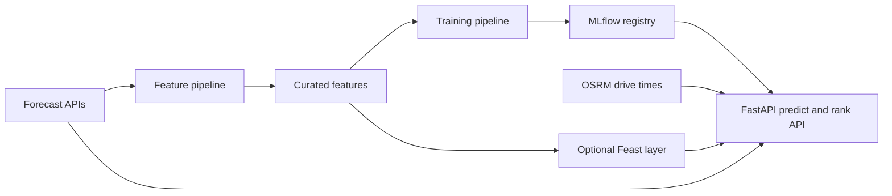
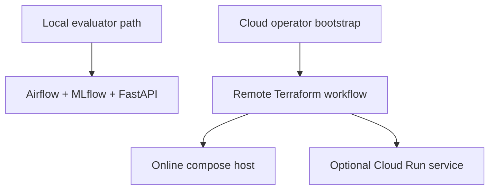

# FoehnCast

FoehnCast ranks Swiss kiteboarding spots for one rider profile. It combines forecast weather, engineered wind features, drive-time data, and a trained quality model to answer one practical question: which spot is worth the trip next?

The repo keeps one stable Feature-Training-Inference split across local evaluation, hosted deployment, and CI/CD. The front page stays short on purpose. The detailed setup and architecture notes live in the project docs: <https://javihslu.github.io/foehncast/>.

## At A Glance



## Current Scope

| Area | Status | Summary |
|------|--------|---------|
| Feature pipeline | Working | Airflow ingests, engineers, validates, and stores curated weather features |
| Training pipeline | Working | Airflow labels data, trains the model, evaluates it, and registers versions in MLflow |
| Inference pipeline | Working | FastAPI serves `/health`, `/spots`, `/predict`, `/rank`, and optional online-feature routes |
| Hosted runtime | Working | Terraform plus `docker-compose.cloud.yml` can run Airflow, MLflow, and the API on a GCP host |
| Automation | Working | GitHub Actions publishes images, validates infrastructure, and drives remote Terraform workflows |

## Choose Your Path

| Path | Use it when | Start here |
|------|-------------|------------|
| Local evaluator | You want the default development and evaluation path with no GCP setup | `./scripts/bootstrap-local.sh` |
| Cloud operator | You want to provision a hosted environment in your own GCP project | `./scripts/bootstrap-gcp.sh` |
| Remote day-2 operations | You already bootstrapped cloud prerequisites and want repeatable plan, apply, destroy, and cleanup commands | `./scripts/terraform-remote.sh` |



## Quick Start

### Local evaluator

This is the default path for a fresh machine.

1. Install Docker.
2. Clone the repository.
3. Run `./scripts/bootstrap-local.sh`.

You do not need `gcloud`, Terraform, GitHub Actions variables, or a local compiler toolchain for this path.

After bootstrap completes, the main local endpoints are:

- App: `http://127.0.0.1:8000`
- Airflow: `http://127.0.0.1:8080`
- MLflow: `http://127.0.0.1:5001`

Example check:

```bash
curl -fsS -X POST http://127.0.0.1:8000/rank \
  -H 'content-type: application/json' \
  -d '{"spot_ids":["silvaplana","urnersee"]}'
```

### Cloud operator

Use this only when you want to run FoehnCast in a GCP project you control. Prefer Google Cloud Shell for the first bootstrap.

1. Open Google Cloud Shell.
2. Clone the repository.
3. Run `./scripts/bootstrap-gcp.sh`.
4. After bootstrap, use `./scripts/terraform-remote.sh plan|apply|destroy|cleanup` for day-2 operations.

## Repository Map

- `src/foehncast/`: application code for configuration, feature engineering, training, inference, monitoring, and spot metadata
- `dags/`: Airflow entry points for the feature and training workflows
- `scripts/`: local bootstrap, cloud bootstrap, remote Terraform, and operator helpers
- `terraform/`: hosted infrastructure definition and operator notes
- `tests/`: regression coverage for pipeline logic and API behavior
- `docs/`: GitHub Pages source for the public project documentation
- `ui/`: Streamlit demo surface

## Read More

- Docs home: <https://javihslu.github.io/foehncast/>
- Getting started: <https://javihslu.github.io/foehncast/getting-started/>
- Architecture: <https://javihslu.github.io/foehncast/system/architecture/>
- Cloud mapping: <https://javihslu.github.io/foehncast/system/cloud-mapping/>
- Feature pipeline: <https://javihslu.github.io/foehncast/system/feature-pipeline/>
- Terraform operator detail: `terraform/README.md`
- Container detail: `containers/README.md`
