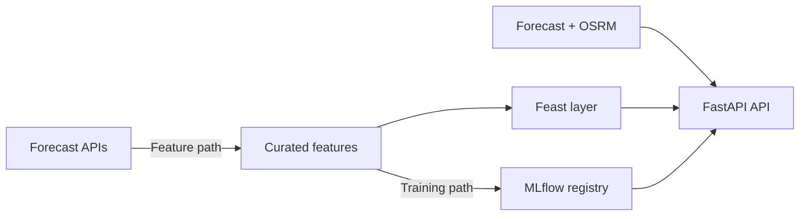
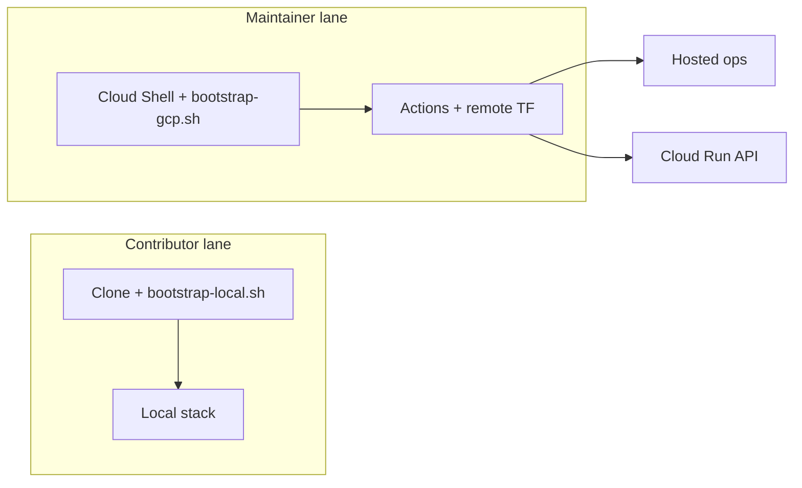

# FoehnCast

FoehnCast ranks Swiss kiteboarding spots for one rider profile. It combines weather forecasts, engineered wind features, drive-time data, and a trained quality model to answer one practical question: which spot is worth the trip next?

The repo keeps the same Feature-Training-Inference split across local runs, hosted deployment, and CI/CD. This front page stays short on purpose. Detailed setup and architecture notes live in the project docs: <https://javihslu.github.io/foehncast/>.

## At A Glance



## Current Scope

| Area | Status | Summary |
|------|--------|---------|
| Feature pipeline | Working | Airflow ingests, engineers, validates, and stores curated weather features |
| Training pipeline | Working | Airflow labels data, trains the model, evaluates it, and registers fresh versions in MLflow under the requested registry alias |
| Inference pipeline | Working | FastAPI serves `/health`, `/spots`, `/predict`, `/rank`, and online-feature routes, and `ui/app.py` provides the Streamlit demo |
| Hosted runtime | Working | The shared environment uses Cloud Run as the only promoted public API path while keeping the hosted full-stack target online for operator tooling |
| Automation | Working | GitHub Actions publishes images, validates infrastructure, and drives remote Terraform workflows |
| Monitoring | Working | Docker Compose runs Prometheus, a StatsD exporter, and Grafana; the app exposes `/metrics`; feature panels are derived from persisted Airflow report summaries; and Grafana loads starter dashboards and alert rules from checked-in config |

## Setup Paths

FoehnCast has one supported contributor setup path: run everything locally with Docker. The shared cloud path is a separate maintainer workflow.



## Quick Start

### Local evaluator

This is the default path for a fresh machine.

1. Install Docker.
2. Clone the repository.
3. Run `./scripts/bootstrap-local.sh`.

You do not need `gcloud`, Terraform, GitHub Actions variables, or a local compiler toolchain for this path.
The bootstrap validates the local evaluator contract, prepares the local-only storage and Feast surfaces, and prints alternate endpoints automatically if the defaults are busy. Use the docs Getting Started and Local Evaluator pages for the deeper runtime details.

After bootstrap completes, the main local endpoints are:

- App: `http://127.0.0.1:8000`
- App metrics: `http://127.0.0.1:8000/metrics`
- Airflow: `http://127.0.0.1:8080`
- MLflow: `http://127.0.0.1:5001`
- Prometheus: `http://127.0.0.1:9090`
- Grafana: `http://127.0.0.1:3000`
- StatsD UDP sink: `127.0.0.1:8125`
- StatsD exporter: `http://127.0.0.1:9102/metrics`

The bootstrap summary also prints the resolved objectstore and Feast online-store emulator endpoints.

Example check:

```bash
curl -fsS -X POST http://127.0.0.1:8000/rank \
  -H 'content-type: application/json' \
  -d '{"spot_ids":["silvaplana","urnersee"]}'
```

For the rider-facing demo, run `uv run streamlit run ui/app.py` from the repo root. The dashboard uses the same prediction and ranking modules as the API, shows the configured rider profile and current serving model version, and follows the current 14-hour live inference window.

## Shared Cloud Automation

The shared hosted environment is separate from normal contributor setup. Contributors only need Docker and the local bootstrap path, not local Terraform, `gcloud`, or `gh`. Maintainers bootstrap once from Google Cloud Shell, then use the documented GitHub Actions plus remote Terraform flow for day-2 changes.

Hosted deployment keeps a narrow scope: the cloud targets deploy runtime services only, while `development_env`, notebooks, docs build tooling, the local objectstore, and the local Datastore emulator stay local or CI-only. Start with [docs/site/system/delivery-and-operator-workflow.md](docs/site/system/delivery-and-operator-workflow.md) for the maintainer workflow split and use `terraform/README.md` for operator detail.

## Repository Map

- `src/foehncast/`: application code for configuration, feature engineering, training, inference, monitoring, and spot metadata
- `ui/`: Streamlit rider-facing demo app
- `dags/`: Airflow entry points for the feature and training workflows
- `scripts/`: local bootstrap plus maintainer utilities
- `terraform/`: maintainer cloud infrastructure definition and reference
- `feature_repo/`: Feast integration surface and config repo
- `prometheus_config/` and `grafana_work/`: checked-in monitoring stack configuration for Prometheus and Grafana
- `tests/`: regression coverage for pipeline logic and API behavior
- `docs/`: GitHub Pages source for the public project documentation

## Read More

- Docs home: <https://javihslu.github.io/foehncast/>
- Getting started: <https://javihslu.github.io/foehncast/getting-started/>
- Architecture: <https://javihslu.github.io/foehncast/system/architecture/>
- Delivery and operator workflow: <https://javihslu.github.io/foehncast/system/delivery-and-operator-workflow/>
- Cloud mapping: <https://javihslu.github.io/foehncast/system/cloud-mapping/>
- Feature pipeline: <https://javihslu.github.io/foehncast/system/feature-pipeline/>
- Terraform operator detail: `terraform/README.md`
- Container detail: `containers/README.md`
