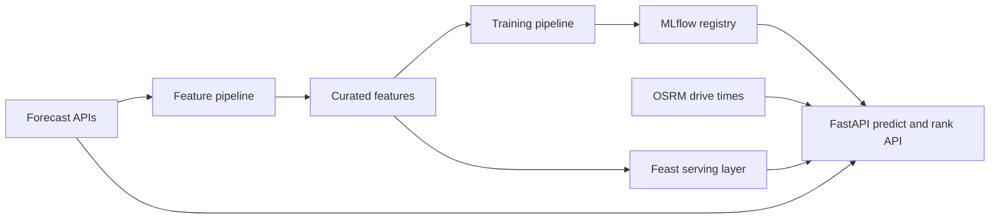
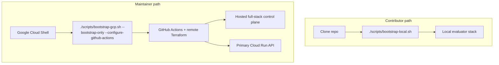

# FoehnCast

FoehnCast ranks Swiss kiteboarding spots for one rider profile. It combines weather forecasts, engineered wind features, drive-time data, and a trained quality model to answer one practical question: which spot is worth the trip next?

The repo keeps the same Feature-Training-Inference split across local runs, hosted deployment, and CI/CD. This front page stays short on purpose. Detailed setup and architecture notes live in the project docs: <https://javihslu.github.io/foehncast/>.

## At A Glance



## Current Scope

| Area | Status | Summary |
|------|--------|---------|
| Feature pipeline | Working | Airflow ingests, engineers, validates, and stores curated weather features |
| Training pipeline | Working | Airflow labels data, trains the model, evaluates it, and registers fresh versions in MLflow under the requested registry alias |
| Inference pipeline | Working | FastAPI serves `/health`, `/spots`, `/predict`, `/rank`, and online-feature routes, and `ui/app.py` provides the Streamlit demo |
| Hosted runtime | Working | The shared environment uses Cloud Run as the only promoted public API path while keeping the hosted full-stack target online for operator tooling |
| Automation | Working | GitHub Actions publishes images, validates infrastructure, and drives remote Terraform workflows |
| Monitoring | Working | Docker Compose runs Prometheus, a StatsD exporter, and Grafana; the app exposes `/metrics`; feature panels are derived from persisted Airflow report summaries; and Grafana loads starter dashboards and alert rules from checked-in config |

## Setup Paths

FoehnCast has one supported contributor setup path: run everything locally with Docker. The shared cloud path is a separate maintainer workflow.



## Quick Start

### Local evaluator

This is the default path for a fresh machine.

1. Install Docker.
2. Clone the repository.
3. Run `./scripts/bootstrap-local.sh`.

You do not need `gcloud`, Terraform, GitHub Actions variables, or a local compiler toolchain for this path.
The local bootstrap uses the bundled MinIO service for curated features and MLflow artifacts. It prepares Feast with the bundled Datastore-mode emulator, runs Airflow against a bundled Postgres metadata database, waits for the feature pipeline to publish a real training-request asset, waits for the resulting asset-triggered training run to finish on a real registry version, and checks that Grafana loaded the checked-in dashboard and alerts before it reports the stack ready. If the default ports are busy, it moves to the next free ports and prints the resolved endpoints.
The checked-in Grafana configuration disables anonymous access, public dashboard sharing, and embedding by default. The local bootstrap applies local-only access overrides so a fresh local run can still verify Grafana provisioning without extra manual setup.
The Streamlit demo and the FastAPI prediction and ranking routes are the rider-facing and service-facing surfaces. Airflow, MLflow, Prometheus, and Grafana are operator surfaces used for validation and monitoring, not the primary product UI.
On a fresh local Airflow state, the scheduled `feature_pipeline` DAG starts unpaused so recurring ingest and preprocessing can run automatically. When the retraining gate passes, it publishes a training-request asset instead of embedding train, evaluate, and register steps inside the feature flow. The `training_pipeline` DAG is scheduled from that asset, so the Airflow Assets view exposes the curated-feature, Feast-sync, training-request, MLflow training, evaluation, and registry hand-offs directly.
The optional `development_env` notebook container is not part of the default path. Start it only when you need notebook or dev-shell Makefile commands.

After bootstrap completes, the main local endpoints are:

- App: `http://127.0.0.1:8000`
- App metrics: `http://127.0.0.1:8000/metrics`
- Airflow: `http://127.0.0.1:8080`
- MLflow: `http://127.0.0.1:5001`
- Prometheus: `http://127.0.0.1:9090`
- Grafana: `http://127.0.0.1:3000`
- StatsD UDP sink: `127.0.0.1:8125`
- StatsD exporter: `http://127.0.0.1:9102/metrics`

The bootstrap summary also prints the resolved objectstore and Feast online-store emulator endpoints.

If you maintain the shared cloud environment, use the separate workflow in [docs/site/system/delivery-and-operator-workflow.md](docs/site/system/delivery-and-operator-workflow.md). Contributors do not need that path for normal work.

Feature-pipeline Grafana panels are backed by the latest summary JSON written under `airflow/reports/`. The app mounts that directory and republishes the summary as Prometheus metrics through `/metrics`, so local dashboard plots and Prometheus queries follow the same contract. The bootstrap also validates the Airflow health payload itself, not just the HTTP status code returned by the webserver.
The pipeline summary writers also keep timestamped history copies under `airflow/reports/history/`, so operator review does not depend on a single mutable latest-summary file.

Prediction requests also append flattened local inference rows to `.state/monitoring/prediction-log.jsonl` as a bounded working set and to `.state/monitoring/prediction-events.jsonl` as the retained history contract. The retained history path can be redirected with `FOEHNCAST_PREDICTION_EVENT_LOG_PATH` when multiple runtimes should contribute to one shared monitoring history.
Public docs should prefer rendered screenshots or exported evidence over live embeds of private operator dashboards.

When the feature-storage backend is BigQuery, FoehnCast treats it as the offline warehouse layer rather than a live serving shortcut. Curated features are written with an explicit table contract: day partitioning on `forecast_time`, clustering on `dataset_name` and `spot_id`, and a retained table lifecycle policy. Longer-horizon monitoring facts belong in retained event history and warehouse tables, not in request handlers or restart-sensitive `/metrics` counters.

Grafana also creates a starter email contact point for the checked-in alert rules. In the local Docker path, that route uses the built-in placeholder address.

The local bootstrap resets Docker volumes, local Airflow metadata, and temporary runtime artifacts, then checks the live `/features/online` route, waits for the asset-triggered training run to succeed, and verifies the Grafana provisioning API before it reports the stack ready.

Example check:

```bash
curl -fsS -X POST http://127.0.0.1:8000/rank \
  -H 'content-type: application/json' \
  -d '{"spot_ids":["silvaplana","urnersee"]}'
```

For the rider-facing demo, run `uv run streamlit run ui/app.py` from the repo root. The dashboard uses the same prediction and ranking modules as the API, shows the configured rider profile and current serving model version, and follows the current 14-hour live inference window.

## Shared Cloud Automation

The shared hosted environment is not part of normal contributor setup.

- Contributors only need Docker and the local bootstrap path.
- Maintainers start in Google Cloud Shell and run `./scripts/bootstrap-gcp.sh --bootstrap-only --configure-github-actions` once.
- After bootstrap, GitHub Actions owns the normal remote Terraform plan, apply, destroy, and cleanup flow for the shared environment.
- Contributors do not need local Terraform, `gcloud`, or `gh` for normal work.

The current shared environment uses Cloud Run as the only promoted public API path. The hosted full-stack target stays online for Airflow, MLflow, and operator monitoring, but it is not treated as a second public serving surface.

The delivery boundary is explicit: GitHub Actions handles reviewed delivery and infrastructure change, while GCP runtime surfaces handle serving, scheduling, retries, and backfills.

Start with [docs/site/system/delivery-and-operator-workflow.md](docs/site/system/delivery-and-operator-workflow.md) for the maintainer workflow split and use `terraform/README.md` for operator detail.

Hosted deployment keeps a narrow scope. The cloud targets deploy runtime services only. `development_env`, notebooks, docs build tooling, the local objectstore, and the local Datastore emulator stay local or CI-only.

## Repository Map

- `src/foehncast/`: application code for configuration, feature engineering, training, inference, monitoring, and spot metadata
- `ui/`: Streamlit rider-facing demo app
- `dags/`: Airflow entry points for the feature and training workflows
- `scripts/`: local bootstrap plus maintainer utilities
- `terraform/`: maintainer cloud infrastructure definition and reference
- `feature_repo/`: Feast integration surface and config repo
- `prometheus_config/` and `grafana_work/`: checked-in monitoring stack configuration for Prometheus and Grafana
- `tests/`: regression coverage for pipeline logic and API behavior
- `docs/`: GitHub Pages source for the public project documentation

## Read More

- Docs home: <https://javihslu.github.io/foehncast/>
- Getting started: <https://javihslu.github.io/foehncast/getting-started/>
- Architecture: <https://javihslu.github.io/foehncast/system/architecture/>
- Delivery and operator workflow: <https://javihslu.github.io/foehncast/system/delivery-and-operator-workflow/>
- Cloud mapping: <https://javihslu.github.io/foehncast/system/cloud-mapping/>
- Feature pipeline: <https://javihslu.github.io/foehncast/system/feature-pipeline/>
- Terraform operator detail: `terraform/README.md`
- Container detail: `containers/README.md`
