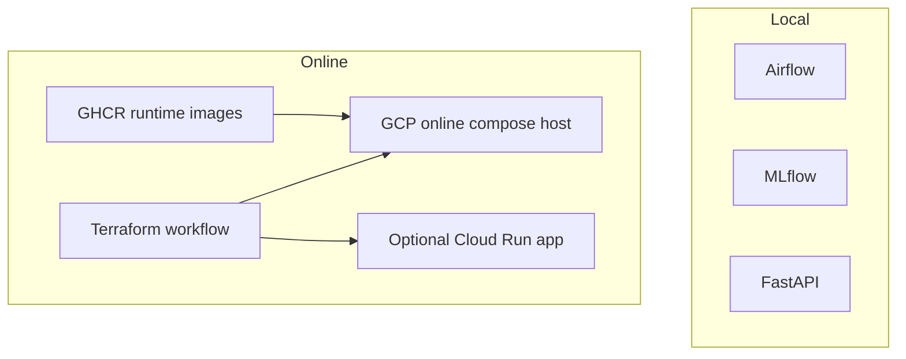

# FoehnCast

FoehnCast ranks Swiss kiteboarding options for one rider profile. It combines forecast weather, engineered wind features, drive-time information, and a trained quality model to answer one practical question: which spot is worth the trip next?

The project keeps one stable Feature-Training-Inference split across all runtime modes. What changes is the hosting model around that split, not the application structure.

## System Shape


## Runtime Modes

| Mode | What runs there | Main use |
|------|-----------------|----------|
| Local Compose baseline | Airflow, MLflow, FastAPI, and the development container | default development and evaluation path |
| Online compose host | the full Airflow, MLflow, and API stack on one GCP host | simplest way to keep the whole project online |
| Optional Cloud Run path | the FastAPI inference service only | inference-only deployment surface |
| GitHub automation | image publishing and Terraform workflows | repeatable delivery for the hosted paths |



## What Works Today

| Area | Current state | Meaning |
|------|---------------|---------|
| Feature pipeline | Working | Airflow can ingest, engineer, validate, and store curated weather features |
| Training pipeline | Working | Airflow can label data, train the model, evaluate it, and register a version in MLflow |
| Inference pipeline | Working | the app serves `/health`, `/spots`, `/predict`, `/rank`, and the optional online-feature routes |
| Online runtime | Working | `docker-compose.cloud.yml` plus Terraform can run Airflow, MLflow, and the API on one online host |
| Cloud Run path | Available | the inference API can also be provisioned separately as a Cloud Run service |
| CI/CD path | Working | GitHub Actions publishes runtime images and can drive Terraform remotely |
| Local reproducibility | Working | `./scripts/bootstrap-local.sh` builds the local stack from a clean state and validates it |

## Local Quick Start

1. Install Docker.
2. Run `./scripts/bootstrap-local.sh`.
3. Open:
   - App: `http://127.0.0.1:8000`
   - Airflow: `http://127.0.0.1:8080`
   - MLflow: `http://127.0.0.1:5001`

The local runtime reads shared settings from `.env`, which the bootstrap script initializes from `.env.example` if needed.

Example check:

```bash
curl -fsS -X POST http://127.0.0.1:8000/rank \
  -H 'content-type: application/json' \
  -d '{"spot_ids":["silvaplana","urnersee"]}'
```

## Hosted Paths

### Full online stack

Use the online compose-host path when you want Airflow, MLflow, and the API running together in the cloud.

1. Publish the runtime images with the `Publish Runtime Images` workflow, or let the host build once from the repo if the images are not published yet.
2. Run the `Terraform` workflow with `apply` and set `provision_online_compose_host=true`.
3. Provide at least:
   - `project_id`
   - `artifact_bucket_name`
    - the repository OIDC variables from `./scripts/configure-github-actions.sh`
4. Read the Terraform output for the public app URL:
   - `online_compose_app_url`
5. Retrieve the generated Airflow admin password from the host when you need UI access:
    - `gcloud compute ssh <host> --zone <zone> --project <project> --command 'sudo cat /opt/foehncast/airflow/.admin-password'`

The online host clones the repo, writes a runtime `.env` file with the Terraform-managed GCP and BigQuery settings, pulls the GHCR images when available, and falls back to local Docker builds on the host if needed.

Only the app is exposed publicly by default. Airflow and MLflow stay bound to the host loopback interface unless you explicitly add `8080` or `5001` to `online_compose_public_ports`.

### Optional Cloud Run service

Cloud Run stays available as an inference-only path for the app service.

- Set `provision_cloud_run_service=true` in the Terraform inputs.
- Provide `mlflow_tracking_uri` so the service can reach the registry.
- Publish the app image through the Artifact Registry plus Cloud Run workflow path.

When you finish a disposable cloud test, run `./scripts/teardown-gcp.sh --plan-only` first to preview the destroy, then rerun without `--plan-only` when you are ready to remove the Terraform-managed resources created from your local `.env` and `terraform/terraform.tfvars`. In a fresh clone with no local Terraform state, the helper skips the Terraform destroy path cleanly. `--clear-github-actions`, `--delete-state-bucket`, and `--delete-project` still work as explicit cleanup actions when you request them. `--delete-project` is intended for disposable smoke environments where you also want the bootstrap-created GCP project queued for deletion, and it prompts for the exact project id unless you also pass `--auto-approve`.

## Deployment Ownership

- The upstream repository is a public source, journal, and automation surface for the shared project.
- Public container images are convenience artifacts, not a shared hosting promise.
- Anyone who wants an online instance should deploy in a fork or in a cloud account they control.
- Compute, storage, network, and managed-service costs stay with the operator of that deployment.
- State-changing upstream workflows are guarded and intended for the shared project environment.

## GitHub Automation

- `.github/workflows/publish-runtime-images.yml`: publishes app, Airflow, MLflow, and development images to GHCR.
- `.github/workflows/terraform.yml`: runs Terraform validate on changes and supports manual remote plan or apply with a GCS backend.
- `.github/workflows/publish-app-image.yml`: keeps the optional Artifact Registry plus Cloud Run path for the inference API.

`./scripts/configure-github-actions.sh` syncs the GCP deploy variables plus the Terraform state bucket defaults back into the repository. When Cloud Run is not provisioned yet, it leaves `GCP_CLOUD_RUN_SERVICE` unset so the guarded workflow stays skipped without carrying stale values.

## Who Uses Which Setup

- **Public upstream repository**: the GitHub Actions workflows are for the shared project environment and should be treated as maintainer automation.
- **Personal deployment**: use `./scripts/bootstrap-gcp.sh` locally or run the same workflows in your own fork after configuring your own GCP variables and secrets.
- **Fork-based automation**: if you want GitHub-hosted deployment for a personal environment, fork the repo and configure the workflows in that fork.

Public users cannot simply use the upstream repository workers for their own deployments. The upstream workflows rely on repository-scoped variables, secrets, package publishing, and cloud identities that belong to the shared environment.

For the current public-repository setup, the maintainers can publish public GHCR images as reusable artifacts. Online runtime costs remain outside GitHub and belong to the operator who starts the cloud resources.

## Optional Feast

Feast stays optional and layered on the same curated features.

1. Install: `uv sync --group feast`
2. Prepare local Feast state: `./scripts/prepare-feast-local.sh`
3. Materialize: `cd feature_repo && uv run --group feast feast materialize-incremental "$(date -u +"%Y-%m-%dT%H:%M:%S")"`
4. Query the helper or HTTP route:
   - `uv run --group feast python -c "from foehncast.inference_pipeline.online_features import get_online_spot_features; print(get_online_spot_features(['silvaplana'], ['wind_speed_10m', 'gust_factor']))"`
   - `curl -fsS -X POST http://127.0.0.1:8000/features/online -H 'content-type: application/json' -d '{"spot_ids":["silvaplana"],"feature_names":["wind_speed_10m","gust_factor"]}'`

## More Detail

- `containers/README.md`
- `terraform/README.md`
- `docs/site/system/cloud-mapping.md`
- `feature_repo/README.md`
