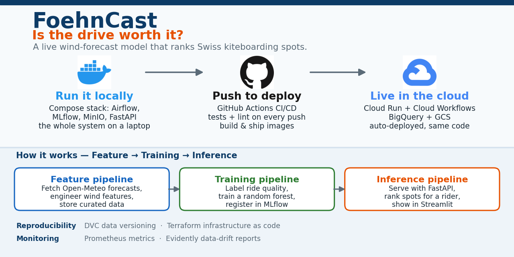
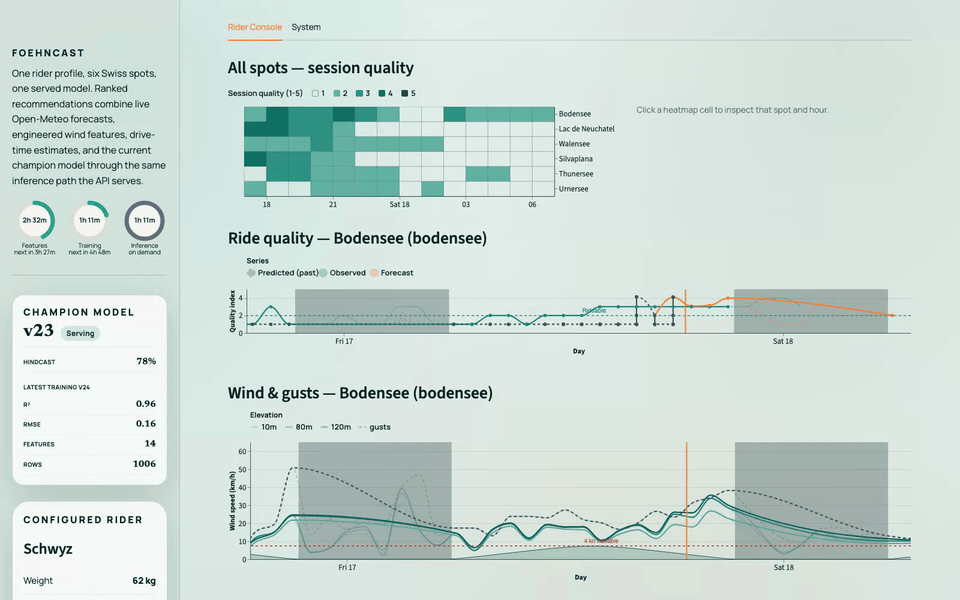
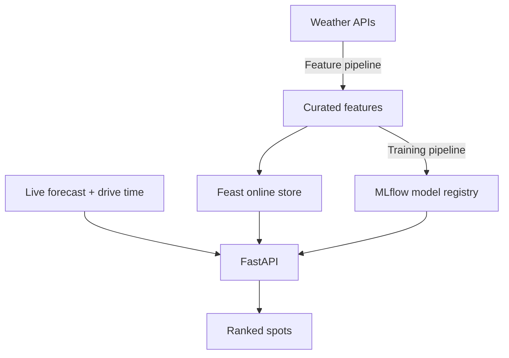
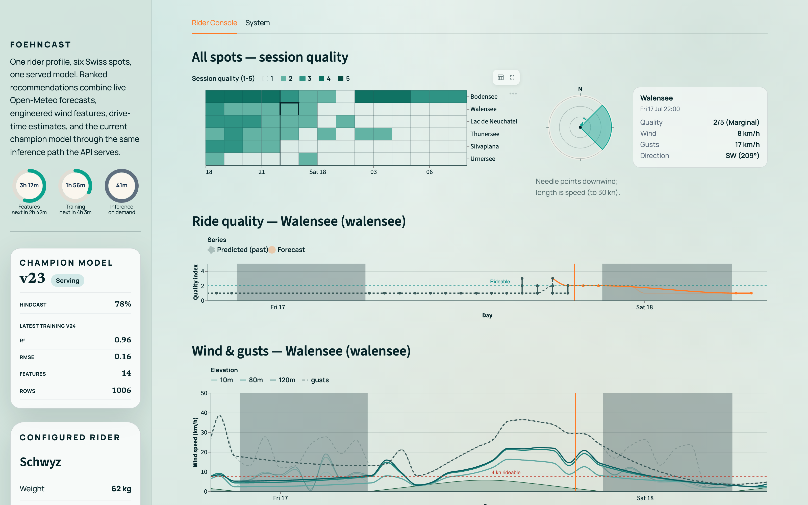
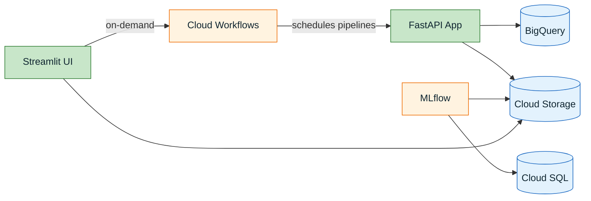

# FoehnCast



[](https://github.com/javihslu/foehncast/actions/workflows/ci.yml)
[](LICENSE)

FoehnCast tells you which Swiss kiteboarding spot is worth the drive today. It pulls weather forecasts, builds features, trains a quality model, and ranks spots through an API — all following the Feature → Training → Inference (FTI) pattern from the HSLU MLOps course.

Full docs: <https://javihslu.github.io/foehncast/>

> **Reviewers:** the [Grading Checklist](https://javihslu.github.io/foehncast/system/grading-checklist/) maps every grading criterion to where it is implemented in the code, docs, and live services.

## How It Works



**Three pipelines, one goal:**

| Pipeline | What it does |
|----------|-------------|
| Feature | Fetches forecasts, engineers wind features, validates data, stores parquet |
| Training | Labels quality, trains a model, evaluates it, registers in MLflow |
| Inference | Serves predictions via FastAPI + ranks spots for one rider profile |

## Quick Start

### Run locally with Docker

```bash
git clone https://github.com/javihslu/foehncast.git
cd foehncast
./scripts/bootstrap-local.sh
```

The script starts the local stack (Airflow, MLflow, MinIO, Prometheus, the app, and the rider console) and runs a smoke test. No cloud credentials are needed.

After bootstrap, you get:

| Service | URL |
|---------|-----|
| Rider console (Streamlit) | `http://127.0.0.1:8501` |
| App (FastAPI) | `http://127.0.0.1:8000` |
| Airflow | `http://127.0.0.1:8080` |
| MLflow | `http://127.0.0.1:5001` |
| Prometheus | `http://127.0.0.1:9090` |

Try it:

```bash
curl -X POST http://127.0.0.1:8000/rank \
  -H 'content-type: application/json' \
  -d '{"spot_ids":["silvaplana","urnersee"]}'
```

### The rider console

<p align="center">
  
  <br />
  <em>Session-quality heatmap across six spots; a selected cell drives the wind dial and metrics, with the serving champion model in the sidebar.</em>
</p>

During the course the full stack also ran on GCP Cloud Run, deployed by Terraform (see [terraform/](terraform/)); the console renders identically there by design. The cloud deployment was taken down after grading to stop incurring cost; everything reproduces locally with the bootstrap script above.

### Reproducible pipelines (DVC)

DVC lets you rerun the offline pipelines deterministically:

```bash
dvc repro          # ingest → curate → train
dvc metrics show   # check training results
```

Both DVC stages call the same Python modules as the Airflow DAGs, so the offline and orchestrated runs share one code path.

### Tests

```bash
make test          # run the unit tests
make lint          # ruff
make coverage      # coverage report
```

## Cloud Deployment

The system also ran on GCP Cloud Run during the course; that deployment was taken down after grading. This section documents the architecture as deployed, and [terraform/](terraform/) remains deployable for your own copy. Contributors do not need cloud access; Docker is enough to run everything locally.



Deployment is handled by Terraform (infrastructure) and Cloud Build triggers (images). See the [Cloud Deployment](https://javihslu.github.io/foehncast/system/cloud-architecture/) docs for details.

## Repo Layout

```
src/foehncast/       # All application code (features, training, inference, monitoring)
dags/                # Airflow DAG definitions
ui/                  # Streamlit dashboard
containers/          # Dockerfiles (6 services)
scripts/             # Bootstrap and helper scripts
terraform/           # GCP infrastructure-as-code
tests/               # pytest unit tests
docs/                # MkDocs source → GitHub Pages
config.yaml          # All tuneable parameters (spots, model, APIs)
dvc.yaml             # Reproducible pipeline stages
```

## Links

- [Grading Checklist](https://javihslu.github.io/foehncast/system/grading-checklist/) — grading criteria mapped to evidence
- [Visual tour](https://javihslu.github.io/foehncast/tour/) — screenshots of the running system
- [Full documentation](https://javihslu.github.io/foehncast/)
- [Getting started](https://javihslu.github.io/foehncast/getting-started/)
- [Architecture](https://javihslu.github.io/foehncast/system/architecture/)
- [Cloud deployment](https://javihslu.github.io/foehncast/system/cloud-architecture/)
- Terraform operator detail: `terraform/README.md`
- Container detail: `containers/README.md`
