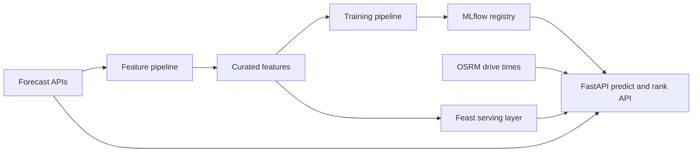
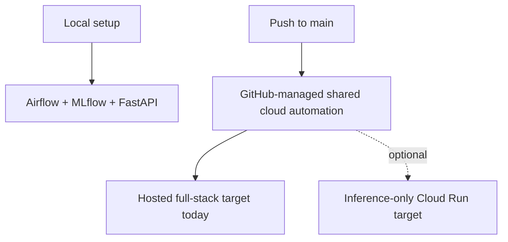

# FoehnCast

FoehnCast ranks Swiss kiteboarding spots for one rider profile. It combines forecast weather, engineered wind features, drive-time data, and a trained quality model to answer one practical question: which spot is worth the trip next?

The repo keeps one stable Feature-Training-Inference split across local evaluation, hosted deployment, and CI/CD. The front page stays short on purpose. The detailed setup and architecture notes live in the project docs: <https://javihslu.github.io/foehncast/>.

## At A Glance



## Current Scope

| Area | Status | Summary |
|------|--------|---------|
| Feature pipeline | Working | Airflow ingests, engineers, validates, and stores curated weather features |
| Training pipeline | Working | Airflow labels data, trains the model, evaluates it, and registers versions in MLflow |
| Inference pipeline | Working | FastAPI serves `/health`, `/spots`, `/predict`, `/rank`, and online-feature routes, and `ui/app.py` provides the Streamlit live-demo surface |
| Hosted runtime | Working | The shared environment currently runs the hosted full-stack target on one GCP host; the inference-only Cloud Run target remains provisionable but is not enabled there |
| Automation | Working | GitHub Actions publishes images, validates infrastructure, and drives remote Terraform workflows |
| Monitoring | Working | Docker Compose provisions Prometheus, a StatsD exporter, and Grafana; the app exposes `/metrics`; and Grafana loads starter dashboards plus alert rules from checked-in config |

## Default Setup

FoehnCast has one supported contributor setup path: run everything locally with Docker.



## Quick Start

### Local evaluator

This is the default path for a fresh machine.

1. Install Docker.
2. Clone the repository.
3. Run `./scripts/bootstrap-local.sh`.

You do not need `gcloud`, Terraform, GitHub Actions variables, or a local compiler toolchain for this path.
The local bootstrap uses the bundled MinIO surface as the default object-access layer for curated feature persistence and MLflow artifacts, prepares Feast against the bundled Datastore-mode emulator, and confirms Grafana loaded the checked-in dashboard plus alerting resources before declaring the stack ready. If the preferred host ports are already busy, the helper moves the local bindings to the next free ports and prints the resolved endpoints.
On a fresh local Airflow state, the scheduled `feature_pipeline` DAG starts unpaused so recurring ingest and preprocessing can run automatically, and it can continue into train, evaluate, and register steps through the same Airflow loop. The standalone `training_pipeline` DAG remains manual for ad hoc reruns.
The optional `development_env` notebook container stays out of the default runtime path and starts only when you explicitly target the notebook or dev-shell Makefile commands.

After bootstrap completes, the main local endpoints are:

- App: `http://127.0.0.1:8000`
- App metrics: `http://127.0.0.1:8000/metrics`
- Airflow: `http://127.0.0.1:8080`
- MLflow: `http://127.0.0.1:5001`
- Prometheus: `http://127.0.0.1:9090`
- Grafana: `http://127.0.0.1:3000`
- StatsD UDP sink: `127.0.0.1:8125`
- StatsD exporter: `http://127.0.0.1:9102/metrics`

The bootstrap summary also prints the resolved objectstore and Feast online-store emulator endpoints.

Prediction requests also append flattened local inference rows to `.state/monitoring/prediction-log.jsonl`. That runtime log lets the monitoring layer compare recent model outputs against earlier outputs from the same model version without mixing disposable service state into `data/`.

Grafana also provisions a starter email contact point for the checked-in alert rules. The local Docker path keeps that route on the built-in placeholder address.

The local bootstrap resets Docker volumes and disposable runtime artifacts, then verifies the live `/features/online` route plus the Grafana provisioning API before it reports the stack ready.

Example check:

```bash
curl -fsS -X POST http://127.0.0.1:8000/rank \
  -H 'content-type: application/json' \
  -d '{"spot_ids":["silvaplana","urnersee"]}'
```

For the rider-facing MS3 demo, run `uv run streamlit run ui/app.py` from the repo root. The dashboard reuses the same prediction and ranking modules as the API, shows the configured rider profile plus current serving model version, and explicitly follows the current 14-hour live inference window instead of inventing a separate forecast contract.

## Shared Cloud Automation

The shared hosted environment is not part of normal contributor setup.

- Contributors only need Docker and the local bootstrap path.
- The shared cloud environment is maintained through GitHub Actions after a one-time maintainer bootstrap.
- Contributors do not need local Terraform, `gcloud`, or `gh` for normal work.

The current shared environment uses the hosted full-stack target so Airflow, MLflow, and the API stay online together. The Cloud Run path remains available as an inference-only option, but it is not the active shared deployment surface today.

Maintainer-only cloud bootstrap and operator details live in `terraform/README.md`.

Hosted deployment keeps its scope narrow. The cloud targets deploy runtime services only; `development_env`, notebooks, docs build tooling, the local objectstore, and the local Datastore emulator stay local or CI-only.

## Repository Map

- `src/foehncast/`: application code for configuration, feature engineering, training, inference, monitoring, and spot metadata
- `ui/`: Streamlit rider-facing demo app for the MS3 presentation flow
- `dags/`: Airflow entry points for the feature and training workflows
- `scripts/`: local bootstrap plus maintainer utilities
- `terraform/`: maintainer cloud infrastructure definition and reference
- `feature_repo/`: Feast integration surface and config repo
- `prometheus_config/` and `grafana_work/`: checked-in monitoring stack configuration for Prometheus and Grafana
- `tests/`: regression coverage for pipeline logic and API behavior
- `docs/`: GitHub Pages source for the public project documentation

## Read More

- Docs home: <https://javihslu.github.io/foehncast/>
- Getting started: <https://javihslu.github.io/foehncast/getting-started/>
- Architecture: <https://javihslu.github.io/foehncast/system/architecture/>
- Cloud mapping: <https://javihslu.github.io/foehncast/system/cloud-mapping/>
- Feature pipeline: <https://javihslu.github.io/foehncast/system/feature-pipeline/>
- Terraform operator detail: `terraform/README.md`
- Container detail: `containers/README.md`
