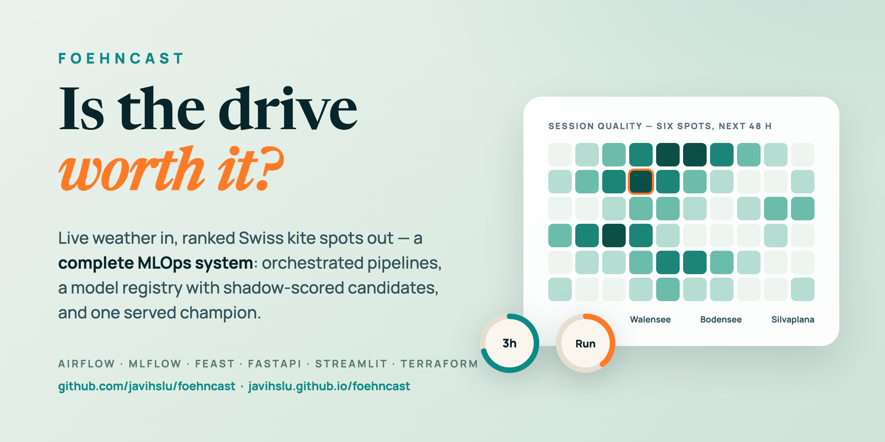
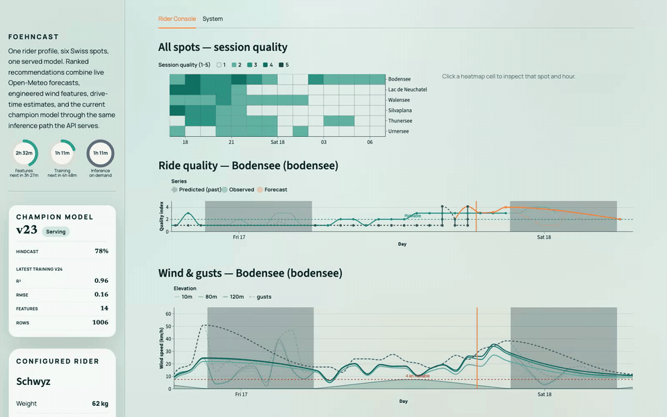
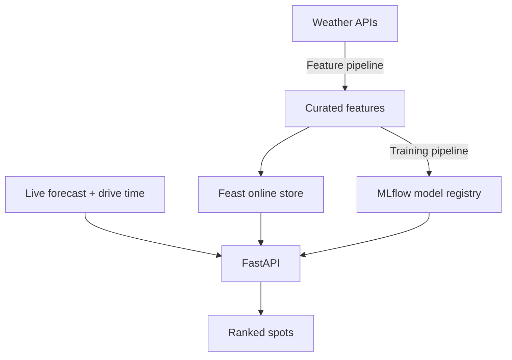
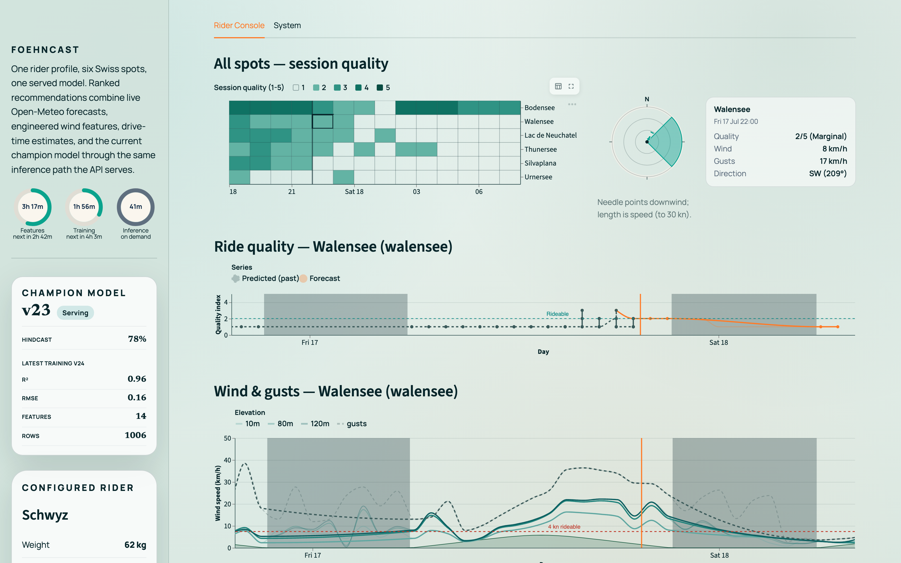
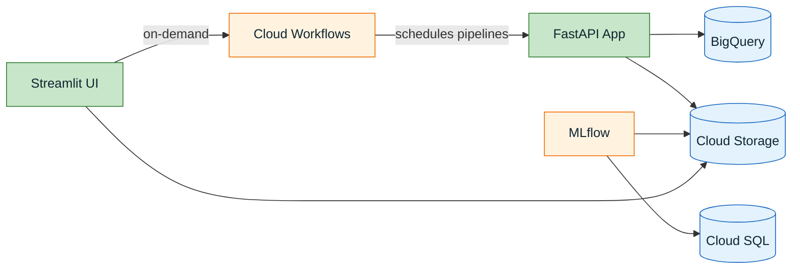

# FoehnCast



[](https://github.com/javihslu/foehncast/actions/workflows/ci.yml)
[](LICENSE)

FoehnCast tells you which Swiss kiteboarding spot is worth the drive today. It pulls weather forecasts, builds features, trains a quality model, and ranks spots through an API — all following the Feature → Training → Inference (FTI) pattern from the HSLU MLOps course.

Full docs: <https://javihslu.github.io/foehncast/>

> **Educational project — not a forecasting service.** FoehnCast was built for the HSLU MLOps module. Its session-quality labels are rule-based and have not been validated against real sessions, so the rankings are a modelling exercise rather than a reliable forecast. Do not rely on it for kiteboarding, water-safety, or any other real-world decision; check current conditions and official forecasts instead. Provided as is, without warranty, under the [MIT License](LICENSE).

**Status: complete.** This project is no longer actively developed. Everything runs locally through the setup below; the hosted demo has been retired. The cloud configuration under [terraform/](terraform/) is kept as reference for how the system deploys to GCP.

## How It Works


```mermaid
flowchart TD
  Forecasts[Weather APIs] -->|Feature pipeline| Curated[Curated features]
  Curated -->|Training pipeline| Registry[MLflow model registry]
  Curated --> Feast[Feast online store]
  Inputs[Live forecast + drive time] --> API[FastAPI]
  Feast --> API
  Registry --> API
  API --> Rank[Ranked spots]
```

**Three pipelines, one goal:**

| Pipeline | What it does |
|----------|-------------|
| Feature | Fetches forecasts, engineers wind features, validates data, stores parquet |
| Training | Labels quality, trains a model, evaluates it, registers in MLflow |
| Inference | Serves predictions via FastAPI + ranks spots for one rider profile |

## Quick Start

### Run locally with Docker

```bash
git clone https://github.com/javihslu/foehncast.git
cd foehncast
./scripts/bootstrap-local.sh
```

The script starts the local stack (Airflow, MLflow, MinIO, Prometheus, the app, and the rider console) and runs a smoke test. No cloud credentials are needed.

The bootstrap seeds about a week of history so it finishes quickly. A model trained on that much data predicts nearly the same quality for every spot, so the local console looks flatter than a cloud deployment trained on a year of history. For comparable results, run `uv run python scripts/backfill-history.py` once the stack is up, then restart the `app` and `ui` containers. Add `--recent-days 7` to also curate the days the Open-Meteo archive has not published yet, which gives the console's coverage strip observed hours to set its predictions against.

After bootstrap, you get:

| Service | URL |
|---------|-----|
| Rider console (Streamlit) | `http://127.0.0.1:8501` |
| App (FastAPI) | `http://127.0.0.1:8000` |
| Airflow | `http://127.0.0.1:8080` |
| MLflow | `http://127.0.0.1:5001` |
| Prometheus | `http://127.0.0.1:9090` |

Try it:

```bash
curl -X POST http://127.0.0.1:8000/rank \
  -H 'content-type: application/json' \
  -d '{"spot_ids":["silvaplana","urnersee"]}'
```

### Render the console without Docker

UI work and visual checks do not need the stack. The console reads a stored
prediction snapshot before it falls back to live inference, so installing one is
enough to render every panel on the host:

```bash
make ui-local
```

That writes a snapshot and starts Streamlit on `http://127.0.0.1:8501`. Wind and
drive times still come from the live Open-Meteo and OSRM APIs; Airflow, MLflow,
MinIO, and the serving container are not involved. With the stack up, `uv run
python scripts/ui_fixture.py --capture` records real predictions once so later
offline runs replay them instead of a synthetic curve.

Fixture snapshots are labelled as such, and the console shows a banner saying the
numbers are not a forecast. Use the full stack for anything that has to be true.

### The rider console

<p align="center">
  
  <br />
  <em>Session-quality heatmap across six spots; a selected cell drives the wind dial and metrics, with the serving champion model in the sidebar.</em>
</p>

The full stack also runs on GCP Cloud Run, deployed by Terraform (see [terraform/](terraform/)); the console renders identically there by design. A hosted demo is deployed from the same Terraform when one is running; deployments are temporary and taken down to avoid idle cost. Everything reproduces locally with the bootstrap script above.

### Reproducible pipelines (DVC)

DVC lets you rerun the offline pipelines deterministically:

```bash
dvc repro          # ingest → curate → train
dvc metrics show   # check training results
```

Both DVC stages call the same Python modules as the Airflow DAGs, so the offline and orchestrated runs share one code path.

### Tests

```bash
make test          # run the unit tests
make lint          # ruff
make coverage      # coverage report
```

## Cloud Deployment

The system runs on GCP Cloud Run. A hosted demo (console plus inference API) is deployed from [terraform/](terraform/) when one is running; deployments are temporary and taken down to avoid idle cost. This section documents the architecture as deployed, and the same Terraform is deployable for your own copy. Contributors do not need cloud access; Docker is enough to run everything locally.


```mermaid
flowchart LR
    classDef public fill:#c8e6c9,stroke:#2e7d32,color:#0f2530
    classDef managed fill:#e3f2fd,stroke:#1565c0,color:#0f2530
    classDef svc fill:#fff3e0,stroke:#ef6c00,color:#0f2530

    UI[Streamlit UI]:::public
    APP[FastAPI App]:::public
    MLF[MLflow]:::svc
    WF[Cloud Workflows]:::svc

    BQ[(BigQuery)]:::managed
    GCS[(Cloud Storage)]:::managed
    SQL[(Cloud SQL)]:::managed

    APP --> BQ & GCS
    MLF --> SQL & GCS
    WF -->|schedules pipelines| APP
    UI -->|on-demand| WF
    UI --> GCS
```

Deployment is handled by Terraform (infrastructure) and Cloud Build triggers (images). See the [Cloud Deployment](https://javihslu.github.io/foehncast/system/cloud-architecture/) docs for details.

## Repo Layout

```
src/foehncast/       # All application code (features, training, inference, monitoring)
dags/                # Airflow DAG definitions
ui/                  # Streamlit dashboard
containers/          # Dockerfiles (6 services)
scripts/             # Bootstrap and helper scripts
terraform/           # GCP infrastructure-as-code
tests/               # pytest unit tests
docs/                # MkDocs source → GitHub Pages
config.yaml          # All tuneable parameters (spots, model, APIs)
dvc.yaml             # Reproducible pipeline stages
```

## Data and Attribution

FoehnCast consumes third-party data under the following terms:

| Source | Used for | Terms |
|--------|----------|-------|
| [Open-Meteo](https://open-meteo.com/) | Weather forecasts and the historical archive | Data licensed [CC BY 4.0](https://creativecommons.org/licenses/by/4.0/); the free API tier is for non-commercial use |
| [MeteoSwiss](https://www.meteoswiss.admin.ch/) via [data.geo.admin.ch](https://data.geo.admin.ch/) | Ten-minute wind station measurements | © Data: MeteoSwiss; source citation required |
| [OSRM](https://project-osrm.org/) on [OpenStreetMap](https://www.openstreetmap.org/copyright) data | Drive time from home to each spot | Map data © OpenStreetMap contributors, [ODbL](https://opendatacommons.org/licenses/odbl/); the public demo server is for light use only, so self-host OSRM for any real deployment |

FoehnCast itself is released under the [MIT License](LICENSE).

## Links

- [Changelog](CHANGELOG.md) — releases since the course freeze
- [Visual tour](https://javihslu.github.io/foehncast/tour/) — screenshots of the running system
- [Full documentation](https://javihslu.github.io/foehncast/)
- [Getting started](https://javihslu.github.io/foehncast/getting-started/)
- [Architecture](https://javihslu.github.io/foehncast/system/architecture/)
- [Cloud deployment](https://javihslu.github.io/foehncast/system/cloud-architecture/)
- [Terraform operator detail](terraform/README.md) - platform inputs, bootstrap, and teardown
- [Container detail](containers/README.md) - the service images and their build contexts
