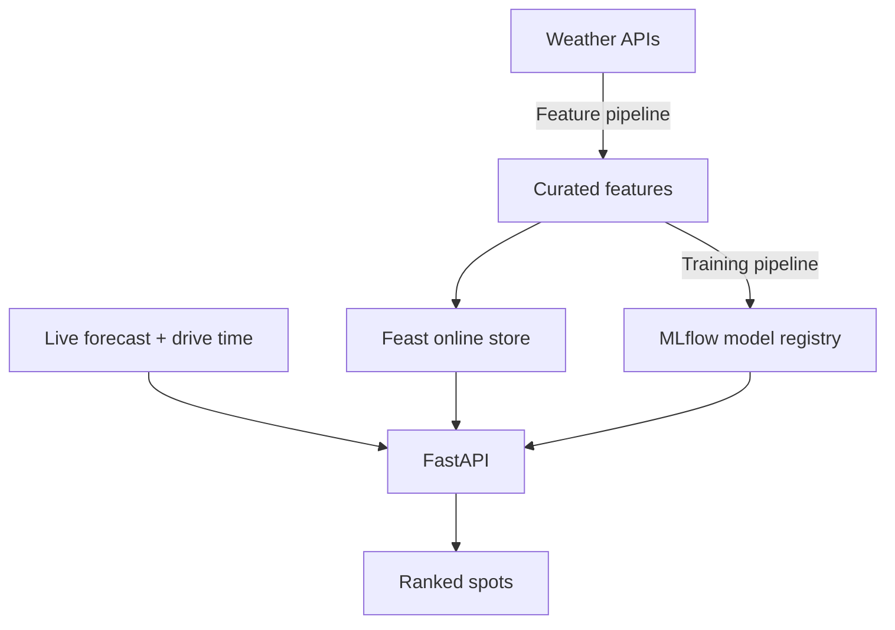

# FoehnCast

FoehnCast predicts which Swiss kiteboarding spot is worth the drive today. A
feature pipeline fetches weather forecasts from Open-Meteo, engineers wind
features, and stores them as curated parquet. A training pipeline labels session
quality, trains a random-forest model, and registers it in MLflow. An inference
pipeline serves predictions through a FastAPI service and ranks spots for a rider
profile, shown in a Streamlit dashboard. The same Python modules run locally with
Docker Compose and in the cloud on GCP Cloud Run, scheduled by Airflow locally
and Cloud Workflows in production. Prometheus and Evidently track service health
and data drift.

## Links

- Repository: <https://github.com/javihslu/foehncast>
- Documentation: <https://javihslu.github.io/foehncast/>
- Live demo (Streamlit UI): offline since project completion; reproduce via the Getting Started guide
- Grading Checklist: <https://javihslu.github.io/foehncast/system/grading-checklist/>
