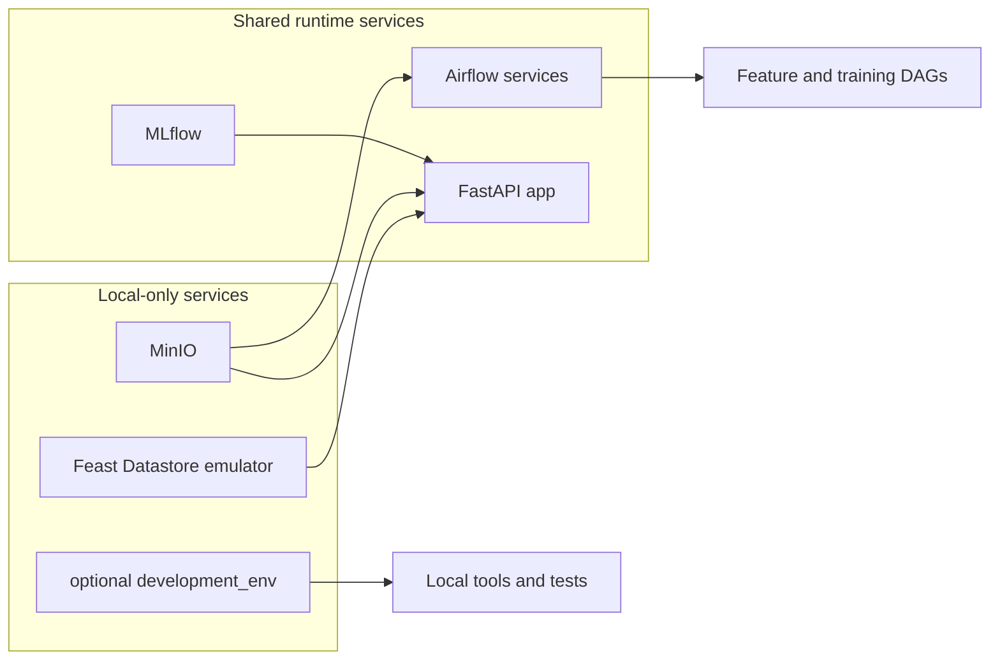

# Container Components

This directory holds the service definitions used by the validated local stack and reused by the online compose-host path.

## Container Stack In One View

## Runtime Role

| Surface | Role |
|---------|------|
| `docker-compose.yml` | shared service baseline for local runs |
| `docker-compose.cloud.yml` | online-host overrides for the full hosted stack |
| `docker-compose.gcp.yml` | local override when Docker services need mounted ADC for BigQuery checks |
| `docker-compose.objectstore.yml` | local runtime extensions for MinIO-backed storage and the Feast Datastore emulator |
| `.env` | shared runtime configuration file initialized by the bootstrap scripts |

- Compose files define services, networks, volumes, dependencies, and environment variables.
- Small startup scripts handle setup steps for each component.
- Init services write a health file when setup is done, so other services can wait for them.

## Deployment Scope

| Surface group | Local evaluator | Hosted full-stack target | Hosted inference target |
|---------------|-----------------|--------------------------|-------------------------|
| optional `development_env`, MinIO, Feast emulator | yes | no | no |
| Airflow, MLflow, app | yes | yes | app only |

## Main Components

### `mlflow/`

- `model-registry`: runs the MLflow tracking and model registry server with SQLite metadata and a runtime-selected artifact destination.
- the local evaluator path points artifacts at the bundled MinIO surface, while the hosted full-stack target points them at the shared GCS bucket.

### `airflow/`

- `airflow-init`: sets up the metadata database, log directories, a clean Airflow 3 config state, and can seed the simple-auth password file when login is enabled.
- `airflow-webserver`: runs the Airflow 3 API server and UI on port 8080 under the repo's legacy service name.
- `airflow-dag-processor`: parses DAG files into the metadata database for the scheduler and UI.
- `airflow-scheduler`: schedules DAG runs.
- `airflow-triggerer`: handles deferred task triggers.

### `development_env/`

- `development_env`: keeps a local development container ready with the project environment synced by `uv`. It is opt-in local tooling for notebooks, ad hoc shells, and container-side checks, not part of the default Airflow runtime path or any hosted target.

### `app/`

- `app`: runs the FastAPI inference service in its own container so prediction and ranking are part of the stack.
- the runtime image includes Feast support and the bundled `feature_repo/` contract so online feature access is part of the deployable app surface.

### `feast_online_store/`

- `feast-online-store`: runs the Firestore emulator in Datastore mode so the local Feast online store matches the hosted Datastore contract more closely without requiring local `gcloud`.

## Default Local Path

For the shortest evaluator path, run `./scripts/bootstrap-local.sh` from the repo root. It builds the local stack, seeds the feature and training DAGs, and checks the API health endpoint.

This path is intentionally GCP-free. You do not need `gcloud`, Terraform, GitHub Actions variables, or Cloud Shell to run it.

The default local path uses the bundled MinIO service for curated feature storage and MLflow artifacts, starts Airflow and MLflow without a login, prepares Feast against the bundled Datastore-mode emulator, and resets Docker volumes plus disposable local runtime artifacts for a clean run each time. The helper keeps the container-side endpoints on `objectstore:9000` and `feast-online-store:8080`, and can shift the host-exposed ports when the preferred defaults are already occupied.
The optional `development_env` container now stays off unless you explicitly target it through the dedicated Makefile notebook and dev-shell commands.
The app image itself is Feast-capable, and the local bootstrap prepares Feast state and verifies the online-feature route before declaring the stack ready.

The initialized local runtime file is `.env`. The bootstrap script creates it from `.env.example` on first run if it does not exist yet.

Run these checks before deployment work:

1. `./scripts/bootstrap-local.sh`
2. `docker compose -f docker-compose.yml -f docker-compose.objectstore.yml ps -a`
3. `curl -fsS http://127.0.0.1:8080/api/v2/monitor/health`
4. `curl -fsS http://127.0.0.1:8000/health`
5. `docker compose -f docker-compose.yml -f docker-compose.objectstore.yml exec -T airflow-scheduler airflow dags list`

## Hosted Reuse

The online compose-host path reuses the same service layout, but changes the runtime context:

- the host writes `.env` from Terraform-managed values
- `development_env`, MinIO, and the Feast emulator do not deploy to the hosted paths
- public exposure defaults to the app only
- Airflow and MLflow remain private unless their ports are deliberately opened
- MLflow artifacts point at the shared GCS bucket instead of the local artifact volume
- runtime images can be pulled from GHCR or built locally on the host if needed

## Build Targets

- Local development uses the base `docker-compose.yml`, so images build natively on the current machine.
- GCP-targeted local runs add `docker-compose.gcp.yml`, which mounts host ADC and pins the deployable app service to `linux/amd64`.
- Example: `docker compose -f docker-compose.yml -f docker-compose.gcp.yml build app`
- For release publishing, keep the same target architecture in CI with `docker buildx build --platform linux/amd64 ...`.
