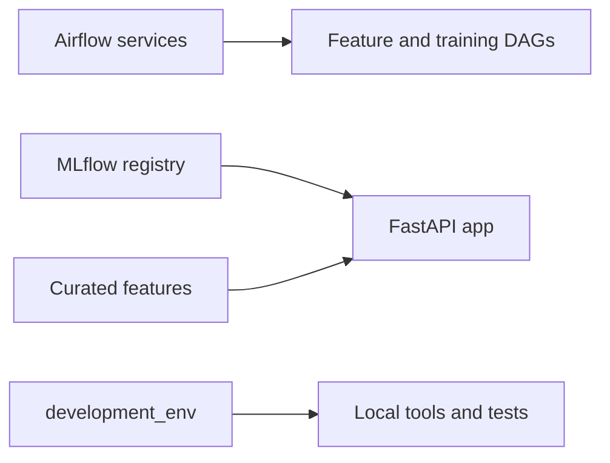

# Container Components

This directory holds the service definitions used by the validated local stack and reused by the online compose-host path.

## Container Stack In One View

## Runtime Role

| Surface | Role |
|---------|------|
| `docker-compose.yml` | shared service baseline for local runs |
| `docker-compose.cloud.yml` | online-host overrides for the full hosted stack |
| `docker-compose.gcp.yml` | local override when Docker services need mounted ADC for BigQuery checks |
| `.env` | shared runtime configuration file initialized by the bootstrap scripts |

- Compose files define services, networks, volumes, dependencies, and environment variables.
- Small startup scripts handle setup steps for each component.
- Init services write a health file when setup is done, so other services can wait for them.

## Main Components

### `mlflow/`

- `model-registry`: runs the MLflow tracking and model registry server with SQLite metadata and a local artifact volume served through MLflow.

### `airflow/`

- `airflow-init`: sets up the metadata database, log directories, and health marker, and can create an admin user when local auth is enabled.
- `airflow-webserver`: serves the UI and API.
- `airflow-scheduler`: schedules DAG runs.
- `airflow-triggerer`: handles deferred task triggers.

### `development_env/`

- `development_env`: keeps a local development container ready with the project environment synced by `uv`. It is part of the local baseline, not the online compose host.

### `app/`

- `app`: runs the FastAPI inference service in its own container so prediction and ranking are part of the stack.

## Default Local Path

For the shortest evaluator path, run `./scripts/bootstrap-local.sh` from the repo root. It builds the local stack, seeds the feature and training DAGs, and checks the API health endpoint.

The default local path keeps feature data on local files, starts Airflow and MLflow without a login, and resets local Docker volumes for a clean run each time.
Optional S3-compatible settings can be injected through the environment for experiments, but they are not part of the default local stack.

The initialized local runtime file is `.env`. The bootstrap script creates it from `.env.example` on first run if it does not exist yet.

Run these checks before deployment work:

1. `docker compose up --build -d --remove-orphans`
2. `docker compose ps -a`
3. `curl -fsS http://127.0.0.1:8080/health`
4. `curl -fsS http://127.0.0.1:8000/health`
5. `docker compose exec -T airflow-scheduler airflow dags list`

## Hosted Reuse

The online compose-host path reuses the same service layout, but changes the runtime context:

- the host writes `.env` from Terraform-managed values
- public exposure defaults to the app only
- Airflow and MLflow remain private unless their ports are deliberately opened
- runtime images can be pulled from GHCR or built locally on the host if needed

## Build Targets

- Local development uses the base `docker-compose.yml`, so images build natively on the current machine.
- GCP-targeted local runs add `docker-compose.gcp.yml`, which mounts host ADC and pins the deployable app service to `linux/amd64`.
- Example: `docker compose -f docker-compose.yml -f docker-compose.gcp.yml build app`
- For release publishing, keep the same target architecture in CI with `docker buildx build --platform linux/amd64 ...`.
