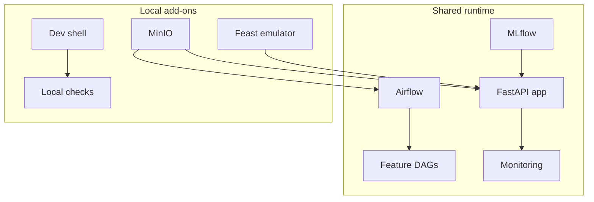

# Container Components

This directory holds the service definitions used by the validated local stack and reused by the hosted full-stack target. The default contributor entrypoint is still `./scripts/bootstrap-local.sh`. This README focuses on the container surfaces behind the local and hosted runtimes. It is not a separate onboarding or operator-workflow guide.

## Container Stack In One View

## Runtime Role

| Surface | Role |
|---------|------|
| `docker-compose.yml` | shared service baseline for local runs |
| `docker-compose.cloud.yml` | online-host overrides for the full hosted stack |
| `docker-compose.gcp.yml` | local override when Docker services need mounted ADC for BigQuery checks |
| `docker-compose.objectstore.yml` | local runtime extensions for MinIO-backed storage and the Feast Datastore emulator |
| `.env` | shared runtime configuration file initialized by the bootstrap scripts |

- Compose files define services, networks, volumes, dependencies, and environment variables.
- Small startup scripts handle setup steps for each component.
- Init services write a health file when setup is done, so other services can wait for them.

## Deployment Scope

| Surface group | Local evaluator | Hosted full-stack target | Hosted inference target |
|---------------|-----------------|--------------------------|-------------------------|
| optional `development_env`, MinIO, Feast emulator | yes | no | no |
| Airflow, MLflow, app | yes | yes | app only |
| Prometheus, StatsD exporter, Grafana | yes | yes | no |

## Main Components

### `mlflow/`

- `model-registry`: runs the MLflow tracking and model registry server with SQLite metadata and a runtime-selected artifact destination.
- the local evaluator path points artifacts at the bundled MinIO surface, while the hosted full-stack target points them at the shared GCS bucket.

### `airflow/`

- `airflow-init`: sets up the metadata database, log directories, a clean Airflow 3 config state, and can seed the simple-auth password file when login is enabled.
- `airflow-webserver`: runs the Airflow 3 API server and UI on port 8080 under the repo's legacy service name.
- `airflow-dag-processor`: parses DAG files into the metadata database for the scheduler and UI.
- `airflow-scheduler`: schedules DAG runs.
- `airflow-triggerer`: handles deferred task triggers.

### `development_env/`

- `development_env`: keeps a local development container ready with the project environment synced by `uv`. It is opt-in local tooling for notebooks, ad hoc shells, and container-side checks, not part of the default Airflow runtime path or any hosted target.

### `app/`

- `app`: runs the FastAPI inference service in its own container so prediction and ranking are part of the stack.
- the runtime image includes Feast support and the bundled `feature_repo/` contract so online feature access is part of the deployable app surface.

### `monitoring/`

- `prometheus`: scrapes the app `/metrics` route, the StatsD exporter, and stack monitoring surfaces.
- `statsd`: exposes the UDP sink that FoehnCast monitoring helpers push to, then republishes them in Prometheus format.
- `grafana`: provisions the Prometheus datasource, starter FoehnCast dashboard, alert rules, and a starter notification route from checked-in config.

The starter notification route stays on a built-in placeholder address for the local Docker path. If the hosted full-stack target needs real mail delivery, inject `FOEHNCAST_GRAFANA_ALERT_EMAIL` through Terraform `online_compose_env_vars` and add Grafana SMTP settings for that tenant.

### `feast_online_store/`

- `feast-online-store`: runs the Firestore emulator in Datastore mode so the local Feast online store matches the hosted Datastore contract more closely without requiring local `gcloud`.

## Default Local Path

For the shortest evaluator path, run `./scripts/bootstrap-local.sh` from the repo root. It builds the local stack, seeds the feature and training DAGs, and checks the app plus Grafana monitoring surfaces.

This path is intentionally GCP-free. You do not need `gcloud`, Terraform, GitHub Actions variables, or Cloud Shell to run it. For end-to-end contributor setup and the resolved local endpoints, use [../docs/site/getting-started.md](../docs/site/getting-started.md) and [../docs/site/system/local-evaluator.md](../docs/site/system/local-evaluator.md). For maintainer-owned hosted delivery, start with [../docs/site/system/delivery-and-operator-workflow.md](../docs/site/system/delivery-and-operator-workflow.md).

The container-specific local additions are MinIO and the Feast Datastore emulator, while `development_env` stays opt-in. The bootstrap initializes `.env` from `.env.example` on first run if needed, can shift host-exposed ports when the defaults are busy, and verifies the main app, monitoring, and online-feature surfaces before declaring the stack ready.

Run these checks before deployment work:

1. `./scripts/bootstrap-local.sh`
2. `docker compose -f docker-compose.yml -f docker-compose.objectstore.yml ps -a`
3. `curl -fsS http://127.0.0.1:8080/api/v2/monitor/health`
4. `curl -fsS http://127.0.0.1:8000/health`
5. `curl -fsS http://127.0.0.1:8000/metrics`
6. `curl -fsS http://127.0.0.1:9090/-/ready`
7. `curl -fsS http://127.0.0.1:3000/api/health`
8. `docker compose -f docker-compose.yml -f docker-compose.objectstore.yml exec -T airflow-scheduler airflow dags list`

## Hosted Reuse

The hosted full-stack target is maintainer-owned and reuses the same service layout, but changes the runtime context: the host writes `.env` from Terraform-managed values, `development_env`, MinIO, and the Feast emulator do not deploy there, public exposure stays narrow and private by default, and MLflow artifacts point at the shared GCS bucket instead of the local artifact volume. In the reviewed hosted path, runtime images are published to Artifact Registry through Cloud Build and pulled onto the host with the VM runtime identity instead of being built locally on the VM.

See [../docs/site/system/hosted-full-stack.md](../docs/site/system/hosted-full-stack.md) for the hosted target contract and [../docs/site/system/delivery-and-operator-workflow.md](../docs/site/system/delivery-and-operator-workflow.md) for the bootstrap and day-2 delivery flow.

## Build Targets

- Local development uses the base `docker-compose.yml`, so images build natively on the current machine.
- GCP-targeted local runs add `docker-compose.gcp.yml`, which mounts host ADC and pins the deployable app service to `linux/amd64`.
- Example: `docker compose -f docker-compose.yml -f docker-compose.gcp.yml build app`
- For reviewed hosted release publishing, GitHub submits Cloud Build builds that publish the deployable images to Artifact Registry.
