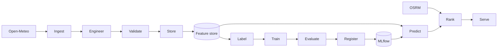

# FoehnCast Project Pages

FoehnCast is designed to rank Swiss kiteboarding spots for one rider profile by combining weather forecasts, engineered wind features, and drive-time information. These pages follow the course milestones and explain how the system is taking shape in the repository.

- **MS1 Proposal**

  Problem framing, data sources, features, and the baseline architecture are fixed.

- **MS2 Coaching**

  The feature and training back-end are being completed. This section tracks what already runs and what still needs clarification.

- **MS3 Presentation**

  This section will collect the demo path, UI story, and the main talking points for the live presentation.

- **MS4 Final Code**

  This section will consolidate the final architecture, reproducibility setup, and monitoring story.

## System at a Glance

## Current Snapshot

| Area | State | Evidence |
|------|-------|----------|
| Configuration | Implemented | `config.yaml` and `src/foehncast/config.py` |
| Feature ingest | Implemented | `feature_pipeline/ingest.py` |
| Feature engineering | Implemented | `feature_pipeline/engineer.py` and unit tests |
| Training path | Scaffolded | `training_pipeline/` modules still need implementation |
| Inference path | Scaffolded | `predict.py`, `rank.py`, and `serve.py` still need implementation |
| Reproducible stack | Planned | Docker and compose files are not in the repo yet |

## Reading Guide

The milestone pages explain the project from the course point of view. The system pages focus on the current technical design with short diagrams, tables, and code excerpts.
