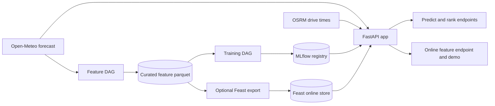
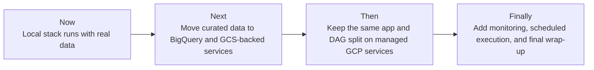

# FoehnCast

FoehnCast ranks Swiss kiteboarding spots for one rider profile by combining live weather forecasts, engineered wind features, drive-time information, and a trained quality model. The project now runs end to end locally with real forecast data, and the public site is meant to show that current state simply.

## What Works Now

| Area | Current state | What it means |
|------|---------------|---------------|
| Feature pipeline | Working | Airflow can ingest, engineer, validate, and store curated weather features for the configured spots |
| Training pipeline | Working | Airflow can label data, train the model, evaluate it, and register a version in MLflow |
| Inference pipeline | Working | The app serves `/health`, `/spots`, `/predict`, and `/rank` from the registered model |
| Optional Feast path | Working | Curated local features can be exported, materialized, and queried through Feast, the helper, the API, and the demo page |
| Local reproducibility | Working | `bootstrap-local.sh` brings the stack up from a clean state and validates the main local path |

## End-to-End Local Flow

## Short Roadmap

The core idea is now fixed: keep the same Feature-Training-Inference split and change the infrastructure in small steps instead of redesigning the code.

- **Now**: the local Docker stack is the proof that the pipelines run together.
- **Next**: the cloud path should reuse the same pipeline boundaries with BigQuery for curated data and GCS-backed artifacts.
- **Then**: deployment should move orchestration and serving to managed GCP services instead of changing the application shape.
- **Finally**: the remaining work is operational polish: automation, monitoring, and final delivery material.

## Reading Guide

- **Home**: short status and roadmap.
- **Milestones**: course-facing progress by submission checkpoint.
- **System**: the working architecture, cloud target, and repository layout.
