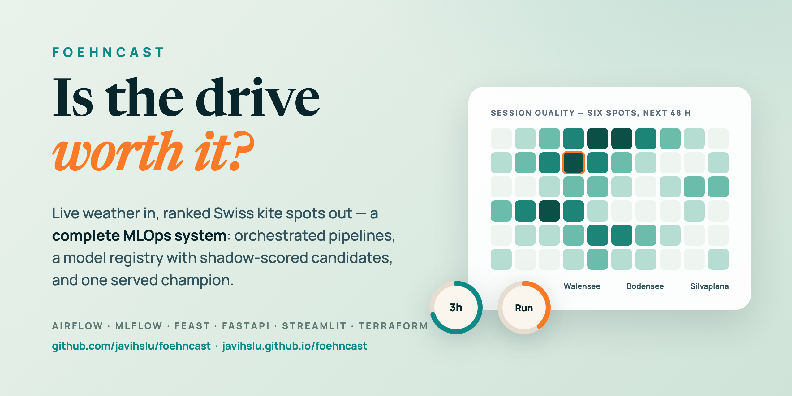

# FoehnCast Docs

FoehnCast tells you which Swiss kiteboarding spot is worth the drive today. It combines live weather forecasts, wind features, drive times, and a trained quality model into a single ranked recommendation.

This site covers how the system works, how to set it up, and how the cloud deployment is structured.

-   [**Quick start**](getting-started.md)

-   [**Visual tour**](tour.md)

-   [**Architecture**](system/architecture.md)

-   [**Grading checklist**](system/grading-checklist.md)

## What It Does

flowchart TD
    WX[Weather forecasts + spot data] --> RANK[Rank spots by quality]
    RIDER[Rider profile + drive time] --> RANK
    RANK --> DECIDE[Pick the best spot]

## Key Features

- **Spot ranking**

    Compares Swiss lake spots using a trained model instead of raw forecast numbers.

- **Personalized**

    Weights wind, drive time, and rider preferences into one score.

- **Shared code path**

    API, UI, and pipelines share the same Python modules.

- **Reproducible**

    The FTI split, DVC, and containers keep runs consistent across machines.

## System Flow

flowchart TD
    INGEST[Fetch forecasts] --> FEATURES[Engineer features] --> TRAIN[Train model] --> SERVE[Serve rankings]

## Reading Paths

Pick the path that matches what you came for:

- **Reviewers** — start at the [Grading Checklist](system/grading-checklist.md). Each criterion links onward to the code, docs, and live services behind it.
- **Reproducing the project** — [Quick Start](getting-started.md) → [Local Stack](system/local-evaluator.md) → [Repository](system/repository.md).
- **Understanding the system** — [Use Case and Data](system/use-case.md) → [Architecture](system/architecture.md) → the [Feature](system/feature-pipeline.md), [Training](system/training-pipeline.md), and [Inference](system/inference-pipeline.md) pipelines → [Model Card](system/model-card.md) → [Monitoring](system/monitoring.md) → [Cloud Deployment](system/cloud-architecture.md).
