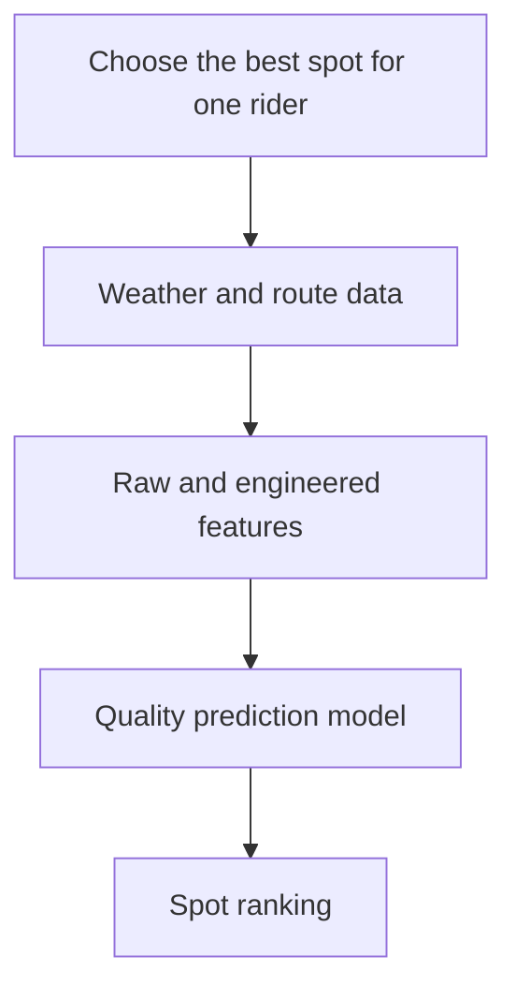

# MS1 Proposal

<span class="fc-pill fc-pill--done">Completed</span>

MS1 fixed the scope of the project: a personalized kiteboarding forecast system with an FTI architecture, a local-first storage baseline, and MLflow as the model registry baseline.

## What Was Fixed in MS1

<div class="grid cards" markdown>

- **Problem**

  Rank Swiss kite spots for one rider profile instead of building a generic weather dashboard.

- **Data**

  Open-Meteo provides forecast and archive data. OSRM adds travel-time personalization. MeteoSwiss is reserved as an observation reference.

- **Features**

  Weather fields are combined with engineered wind-quality features such as steadiness and gust factor.

- **Architecture**

  The repository is split into feature, training, and inference pipelines with a feature store and MLflow between them.

</div>

## Feature Vector Used by the First Model

```yaml
model:
  features:
    - wind_speed_10m
    - wind_speed_80m
    - wind_direction_10m
    - wind_gusts_10m
    - temperature_2m
    - relative_humidity_2m
    - wind_steadiness
    - gust_factor
    - shore_alignment
```

## Where MS1 Already Appears in the Repository

| Proposal choice | Repository trace |
|-----------------|------------------|
| Central configuration | `config.yaml` and `src/foehncast/config.py` |
| Feature engineering around wind quality | `src/foehncast/feature_pipeline/engineer.py` |
| Test coverage for core feature logic | `tests/test_ingest.py` and `tests/test_engineer.py` |
| Local-first storage baseline | `storage.backend: local` in `config.yaml` |
| MLflow registry baseline | `mlflow` section in `config.yaml` |

## Visual Summary


