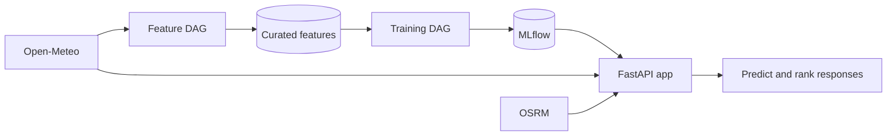

# MS2 Backend

Completed

MS2 is the point where the project stopped being just a proposal. The local stack now runs the feature, training, and inference paths together with real forecast data.

## What Runs End To End

## Current Backend Status

| Area | State | Notes |
|------|-------|-------|
| `config.py` | done | Loads and caches `config.yaml` |
| `feature_pipeline.ingest` | done | Fetches forecast data for all configured spots |
| `feature_pipeline.engineer` | done | Adds wind-quality and time features |
| `feature_pipeline.validate` | done | Checks required columns and simple range rules |
| `feature_pipeline.store` | done | Writes feature data to local or S3-compatible storage |
| `training_pipeline` | done | Labels data, trains the model, logs metrics, and registers a version in MLflow |
| `inference_pipeline` | done | Serves `/health`, `/spots`, `/predict`, and `/rank` |
| `dags/` | done | Airflow runs the feature DAG and the training DAG |
| Docker stack | done | Airflow, MLflow, app, and development container run through Compose |
| Optional Feast path | done | Curated local features can also be exported, materialized, and queried online |

## What Was Validated

- `airflow dags test feature_pipeline 2024-01-01` completed successfully.
- `airflow dags test training_pipeline 2024-01-01` completed successfully.
- `curl -fsS http://127.0.0.1:8000/health` returned a healthy API response.
- `curl -fsS -X POST http://127.0.0.1:8000/predict ...` returned live predictions from the app container.
- `docker compose --env-file .env.example exec -T development_env uv run pytest` passed with `72 passed`.

## Why MS2 Matters

- The full FTI split now exists in runnable code.
- Airflow is already exercising the feature and training paths.
- The app already serves the inference path from the registered model.
- The local stack is a proof of execution, not a mock-up.

## Next Step Toward The Cloud

MS2 proves that the back-end is running locally in containers. The next step is to map the same pipeline split to managed cloud services such as cloud-hosted Airflow, cloud storage, and the later BigQuery-based data path without changing the pipeline boundaries.
