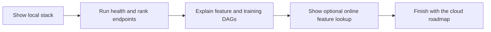

# MS3 Presentation

In preparation

MS3 is the presentation checkpoint. The technical job here is not to add a second system, but to explain the working one clearly.

## Demo Story

- **Live flow**

  Show how data moves from forecast ingestion to spot ranking in one simple path.

- **System explanation**

  Walk through the FTI split, the local proof of execution, and the cloud hand-off.

- **User view**

  Use the API responses and the optional online-feature demo page as a compact front-end story.

## What The Presentation Should Make Obvious

- The pipelines already run end to end locally with real data.
- Airflow is already executing the feature and training jobs.
- The app already serves predictions, ranking, and optional online feature lookup.
- The roadmap is incremental: keep the same code split and move the infrastructure to managed cloud services.
