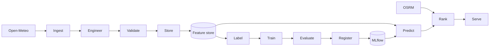

# Architecture

FoehnCast follows the Feature-Training-Inference pattern. This keeps data preparation, model work, and serving logic separate.

## FTI Overview

## Pipeline Responsibilities

| Layer | Role | Current state |
|------|------|---------------|
| Feature pipeline | Collect, transform, validate, and store weather data | ingest and engineer are implemented |
| Training pipeline | Build labels, train the model, evaluate it, and register it | planned |
| Inference pipeline | Produce predictions, rank spots, and expose results | planned |
| Shared services | Feature store and model registry | planned baseline in config |

## Infrastructure Baseline

| Component | Baseline |
|-----------|----------|
| Feature storage | Local Parquet files |
| Model registry | MLflow |
| Serving | FastAPI |
| Orchestration | Airflow |
| Monitoring | Drift detection plus dashboard tooling |
