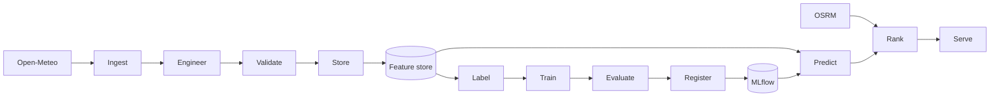

# Architecture

FoehnCast follows the Feature-Training-Inference pattern. This keeps data preparation, model work, and serving logic separate.

## FTI Overview

## Pipeline Responsibilities

| Layer | Role | Current state |
|------|------|---------------|
| Feature pipeline | Collect, transform, validate, and store weather data | implemented and runnable through Airflow |
| Training pipeline | Build labels, train the model, evaluate it, and register it | implemented and runnable through Airflow |
| Inference pipeline | Produce predictions, rank spots, and expose results | implemented in the app container |
| Shared services | Feature store and model registry | running in the local stack |

## Infrastructure Baseline

| Component | Local now | Cloud target |
|-----------|-----------|--------------|
| Feature storage | Local Parquet or S3-compatible storage | BigQuery |
| Model registry | MLflow with local services | MLflow with cloud-backed artifacts |
| Serving | FastAPI app container | Cloud Run |
| Orchestration | Airflow containers | Cloud Composer / managed Airflow |
| Artifacts | MinIO | GCS |
| Monitoring | local baseline and stubs | later MS4 work |

## Current Validation

- The feature DAG runs successfully in Airflow.
- The training DAG runs successfully in Airflow.
- The inference service responds from its own container.
- The container-side test suite passes.

## Cloud Direction

The local stack is now a proof of execution, not the final hosting model. The next step is to map the same pipeline boundaries onto managed GCP services instead of changing the application structure.

See the cloud target in [cloud-mapping.md](cloud-mapping.md).
