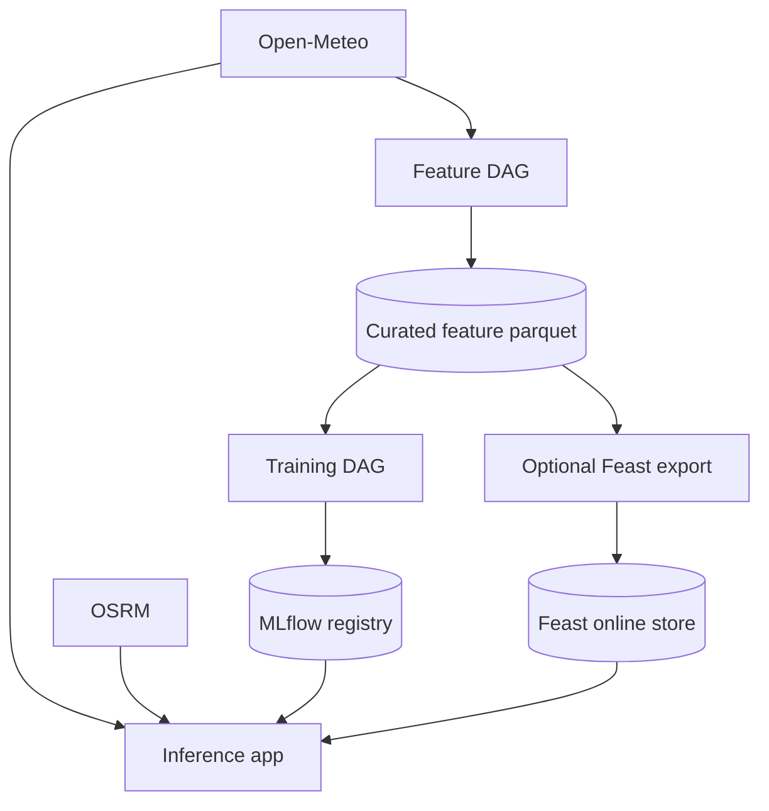
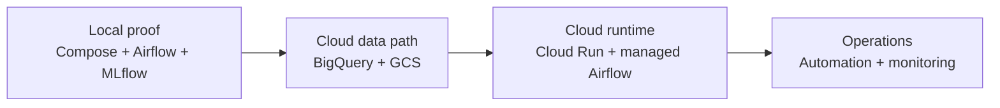

# Architecture

FoehnCast keeps a clear Feature-Training-Inference split. The important point now is that these boundaries are no longer only planned: they run together locally and form the base for the cloud roadmap.

## Working Local Architecture

## Pipeline Responsibilities

| Layer | Role | Current state |
|------|------|---------------|
| Feature pipeline | Collect, transform, validate, and store weather data | implemented and runnable through Airflow |
| Training pipeline | Label data, train the model, evaluate it, and register it | implemented and runnable through Airflow |
| Inference pipeline | Produce predictions, rank spots, and expose results | implemented in the app container |
| Optional feature serving | Surface curated rows through Feast for online lookup | implemented as an optional layer on top of the same local features |

## Infrastructure Baseline

| Component | Local now | Cloud target |
|-----------|-----------|--------------|
| Feature storage | Local Parquet, with optional Feast export on top | BigQuery, optionally surfaced through Feast |
| Model registry | MLflow with local services | MLflow with cloud-backed artifacts |
| Serving | FastAPI app container | Cloud Run |
| Orchestration | Airflow containers | Cloud Composer / managed Airflow |
| Artifacts | Local MLflow artifact volume | GCS |
| Monitoring | Minimal local baseline | later MS4 work |

## Current Validation

- The feature DAG runs successfully in Airflow.
- The training DAG runs successfully in Airflow.
- The inference service responds from its own container.
- The optional Feast path can apply, materialize, and serve online features.
- The container-side test suite passes.

## Roadmap Shape

The local stack is now a proof of execution, not the final hosting model. The next step is to map the same pipeline boundaries onto managed GCP services instead of changing the application structure.

An optional Feast repo can now sit on top of the same curated features: local runs can export a single parquet source for Feast, while the cloud path can point the same logical feature view at BigQuery.

See the cloud target in [cloud-mapping.md](cloud-mapping.md).
