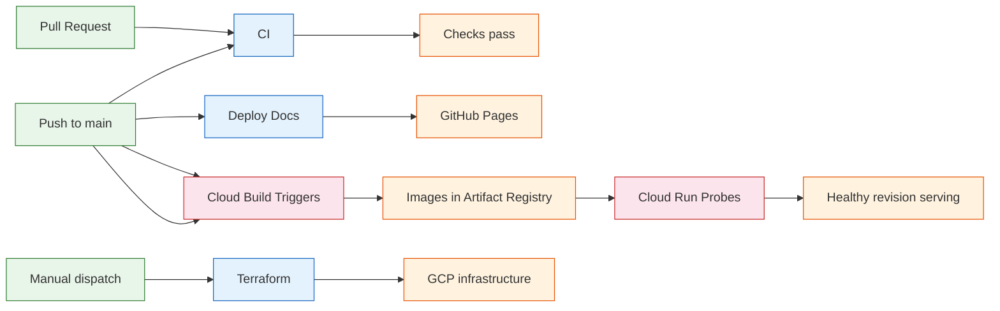
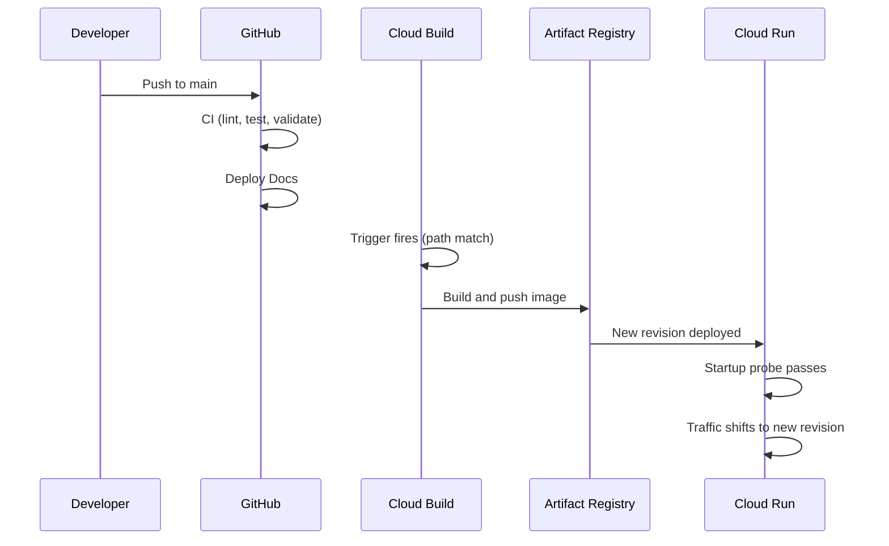

# CI/CD and Automation

This page explains the automation strategy: what runs in GitHub Actions, what runs natively in GCP, and how they connect.

## Architecture

GitHub Actions handles fast validation (lint, test, docs). GCP handles building, deploying, and health management natively via Cloud Build triggers and Cloud Run probes.

## GitHub Actions Workflows

### CI (`ci.yml`)

**Purpose:** Validates code quality on every PR and push to main.

| Job | What it checks |
|-----|---------------|
| gate | Owner verification + path filtering |
| lint | `ruff check` and `ruff format --check` |
| test | Full pytest suite (450 tests) |
| compose | Docker Compose config validation + image builds |
| shell | Bash syntax check on all scripts |
| terraform | `terraform init/fmt/validate` (no remote state) |
| dvc | Pipeline DAG, parameter drift, lockfile integrity |
| docs | `mkdocs build --strict` (catches broken links) |

**Triggers:** PR to main, push to main, manual dispatch.

### Terraform (`terraform.yml`)

**Purpose:** Manages GCP infrastructure lifecycle (manual only).

| Command | What it does |
|---------|-------------|
| plan | Preview changes (default) |
| apply | Deploy infrastructure |
| destroy | Tear down all Terraform-managed resources |
| cleanup | Remove state bucket and/or GitHub Actions variables |

Variable resolution is handled by `scripts/resolve-terraform-inputs.sh`, which merges workflow inputs with repository variables and applies defaults.

**Triggers:** Manual dispatch only. Infrastructure changes are deliberate.

**Requires:** Completed GCP bootstrap (Workload Identity Federation).

### Deploy Docs (`docs.yml`)

**Purpose:** Builds MkDocs and deploys to GitHub Pages.

**Triggers:** Push to main when `docs/` source changes.

## GCP-Native Automation

### Cloud Build Triggers

Four Cloud Build triggers fire directly on push to main (via Developer Connect):

| Trigger | Cloud Build config | Path filter |
|---------|-------------------|-------------|
| publish-app | `cloudbuild/app.yaml` | `src/**`, `containers/app/**` |
| publish-airflow | `cloudbuild/airflow.yaml` | `containers/airflow/**`, `dags/**` |
| publish-mlflow | `cloudbuild/mlflow.yaml` | `containers/mlflow/**` |
| publish-ui | `cloudbuild/ui.yaml` | `ui/**`, `containers/ui/**` |

Each build pushes to Artifact Registry with `sha-<commit>` and `latest` tags.

### Cloud Run Health Probes

Cloud Run services have startup and liveness probes configured in Terraform:

- **Startup probe:** Checks `/health` on boot; failed revisions never receive traffic
- **Liveness probe:** Checks `/health` every 30s; unhealthy instances are restarted
- **Automatic rollback:** If a new revision fails startup, the previous revision stays active

This replaces manual health verification scripts.

### Developer Connect

Developer Connect links the GitHub repository to GCP, authorizing Cloud Build to trigger directly on push without GitHub Actions as an intermediary.

## Access Control

All GitHub Actions workflows restrict execution to the repository owner. Cloud Build triggers use GCP IAM for access control.

## How They Connect

