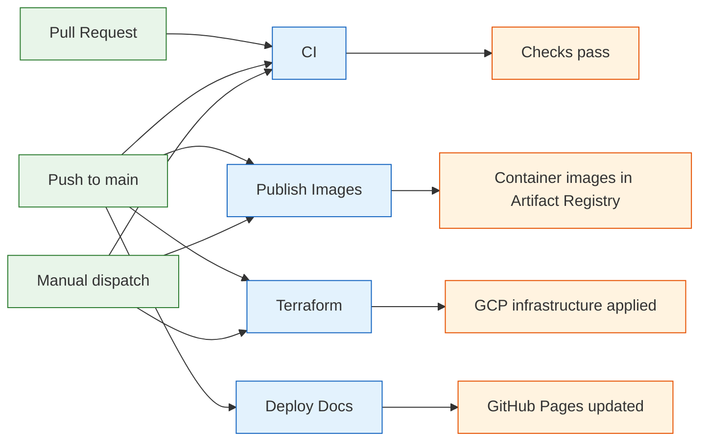
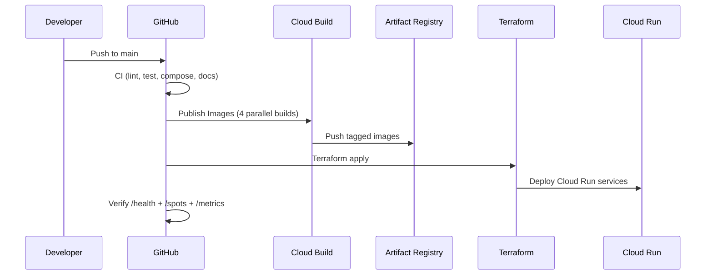

# CI/CD and Automation

This page explains what each GitHub Actions workflow does, when it runs, and how the pieces connect.

## Workflow Overview

## Workflows

### CI (`ci.yml`)

**Purpose:** Validates code quality on every PR and push to main.

| Job | What it checks |
|-----|---------------|
| gate | Owner verification + path filtering |
| lint | `ruff check` and `ruff format --check` |
| test | Full pytest suite (452 tests) |
| compose | Docker Compose config validation + image builds |
| shell | Bash syntax check on all scripts |
| terraform | `terraform init/fmt/validate` (no remote state) |
| dvc | Pipeline DAG, parameter drift, lockfile integrity |
| docs | `mkdocs build --strict` (catches broken links) |

**Triggers:** PR to main, push to main, manual dispatch.

### Publish Images (`publish-images.yml`)

**Purpose:** Builds container images via Cloud Build and pushes to Artifact Registry.

Builds four images in parallel using a matrix:

| Image | Cloud Build config | Contains |
|-------|-------------------|----------|
| foehncast-app | `cloudbuild/app.yaml` | FastAPI serving app |
| foehncast-airflow | `cloudbuild/airflow.yaml` | Airflow with DAGs |
| foehncast-mlflow | `cloudbuild/mlflow.yaml` | MLflow tracking server |
| foehncast-ui | `cloudbuild/ui.yaml` | Streamlit dashboard |

Each image gets two tags: an immutable `sha-<commit>` and a floating `latest` (on main only).

**Triggers:** Push to main when source, containers, or config changes. Manual dispatch.

**Requires:** Repository variables `GCP_PROJECT_ID`, `GCP_LOCATION`, `GCP_ARTIFACT_REPOSITORY`, `GCP_WORKLOAD_IDENTITY_PROVIDER`, `GCP_SERVICE_ACCOUNT_EMAIL`.

### Terraform (`terraform.yml`)

**Purpose:** Manages GCP infrastructure lifecycle.

| Command | What it does |
|---------|-------------|
| plan | Preview changes (default for manual dispatch) |
| apply | Deploy infrastructure (auto on push to main) |
| destroy | Tear down all Terraform-managed resources |
| cleanup | Remove state bucket and/or GitHub Actions variables |

Variable resolution is handled by `scripts/resolve-terraform-inputs.sh`, which merges workflow inputs with repository variables and applies defaults.

After apply, the workflow verifies the deployed Cloud Run service responds correctly on `/health`, `/spots`, and `/metrics`.

**Triggers:** Push to main when `terraform/` changes. Manual dispatch with command selection.

**Requires:** Completed GCP bootstrap (Workload Identity Federation).

### Deploy Docs (`docs.yml`)

**Purpose:** Builds MkDocs and deploys to GitHub Pages.

**Triggers:** Push to main when `docs/` source changes.

## Composite Action

### `load-gcp-repo-config`

Reads all `GCP_*` repository variables from `toJson(vars)` and outputs them as normalized step outputs. Used by both the Publish and Terraform workflows to avoid duplicating variable loading logic.

## Access Control

All workflows restrict execution to the repository owner. This prevents forks or external contributors from triggering Cloud Build or Terraform operations.

## How They Connect

