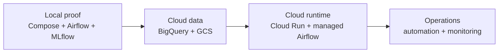
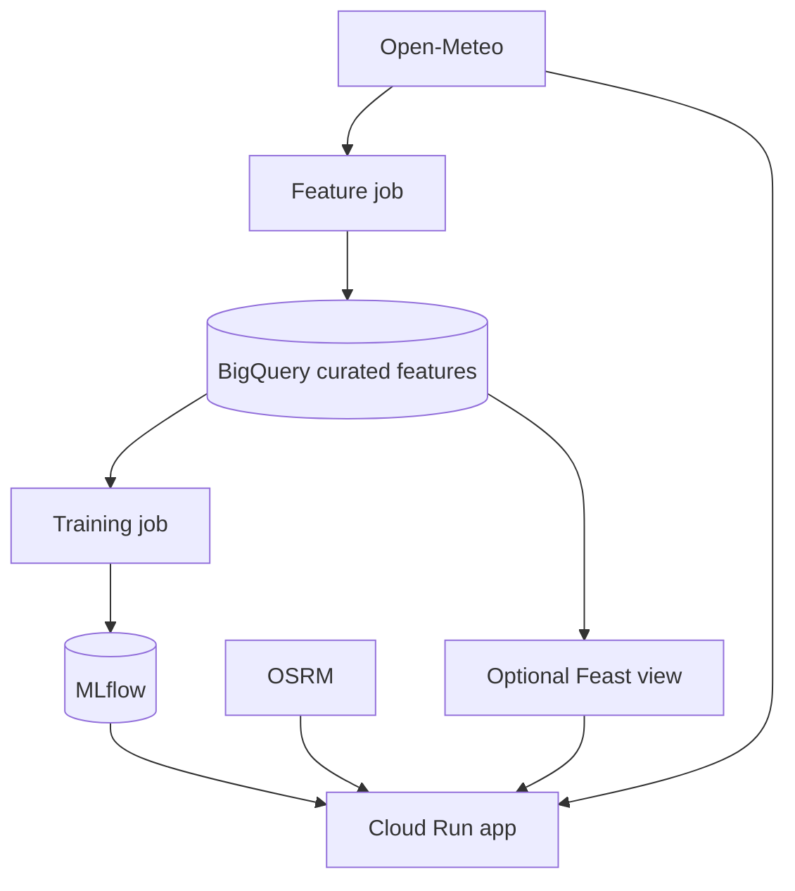

# Cloud Mapping

FoehnCast keeps the same Feature-Training-Inference split in the cloud. The goal is simple: move the validated local stack onto managed GCP services instead of redesigning the project.

## Mapping Principle

- Local Docker proves that the pipelines run together.
- Cloud deployment keeps the same pipeline boundaries.
- Cloud services replace the local support services used for evaluation and development.
- The app remains a deployable container because inference is a service, not a DAG.

## Roadmap Diagram

## Local To Cloud Mapping

| Local component | Cloud target | Role |
|----------------|-------------|------|
| `app` container | Cloud Run service | Serve `/health`, `/spots`, `/predict`, and `/rank` |
| Airflow containers | Cloud Composer / managed Airflow | Schedule and run feature and training DAGs |
| Local MLflow artifact volume | GCS bucket | Store model artifacts and other object data |
| Local feature storage and optional Feast parquet export | BigQuery tables or a Feast-backed BigQuery view | Hold curated feature data for cloud pipelines |
| MLflow with SQLite + local artifacts | MLflow service with GCS-backed artifacts | Track runs, metrics, and registered model versions |
| Artifact Registry bootstrap | Artifact Registry | Store deployable container images |
| `development_env` container | CI jobs and local prototyping only | Keep local workflows reproducible without becoming a cloud runtime |

## Cloud Pipeline Shape

- **Feature pipeline**: write curated rows to BigQuery.
- **Training pipeline**: read curated rows, train, evaluate, and register through MLflow.
- **Inference pipeline**: keep serving inside the app container on Cloud Run.
- **Optional Feast path**: point the same logical feature view at BigQuery instead of local parquet.

## What Changes In The Cloud

| Area | Local now | Cloud target |
|------|-----------|--------------|
| Feature storage | local Parquet, optional S3-compatible store, optional Feast parquet export | BigQuery, optionally surfaced through Feast |
| Artifacts | local MLflow artifact volume | GCS |
| Orchestration | local Airflow containers | Cloud Composer / managed Airflow |
| Inference | local app container | Cloud Run |
| Runtime auth | local env file | service accounts and OIDC |

## What Is Already In Place

- Terraform already covers the first cloud runtime slice.
- The repo already contains a Cloud Run deployment path and Artifact Registry publishing flow.
- The application already supports a `bigquery` storage backend through the shared feature-store abstraction.
- Local container runs can already mount ADC for BigQuery-based checks.

## What Still Needs To Be Finished

- Finalize the managed MLflow hosting choice.
- Finalize managed Airflow provisioning and DAG deployment.
- Add the remaining automation and monitoring needed for the final submission.

## Why This Fits The Project Brief

The project brief asks for cloud-ready pipelines and cloud orchestration. This mapping keeps the backend already validated in MS2, but replaces the local support stack with cloud services that can run autonomously after deployment.
