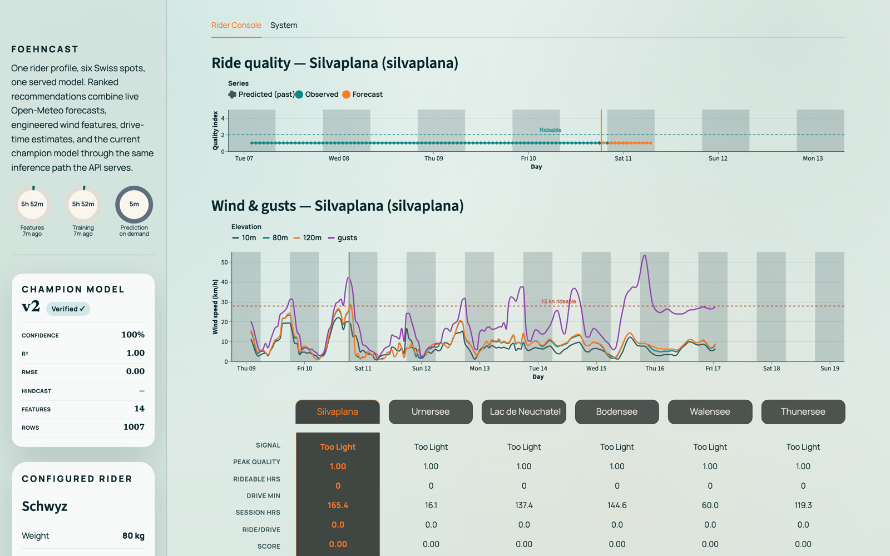
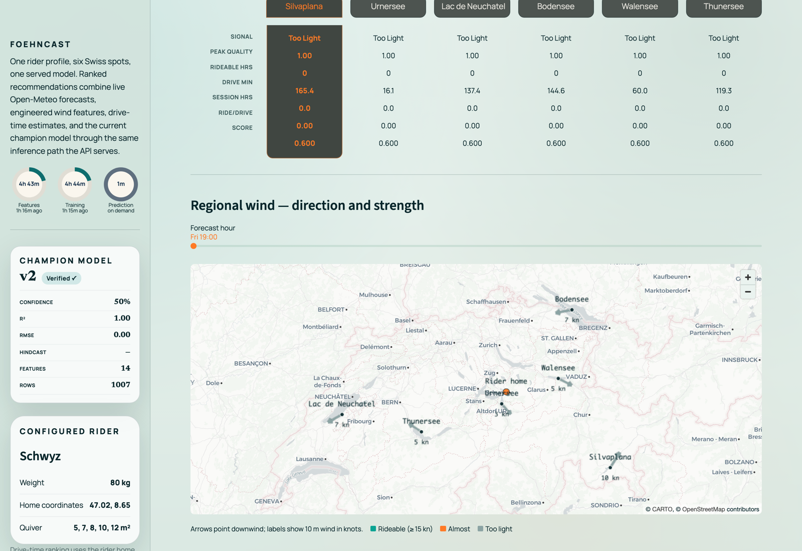
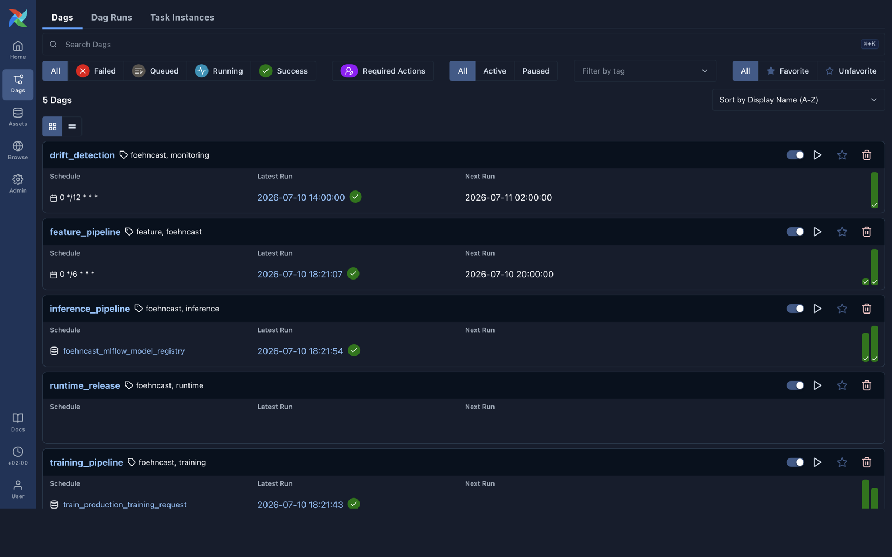
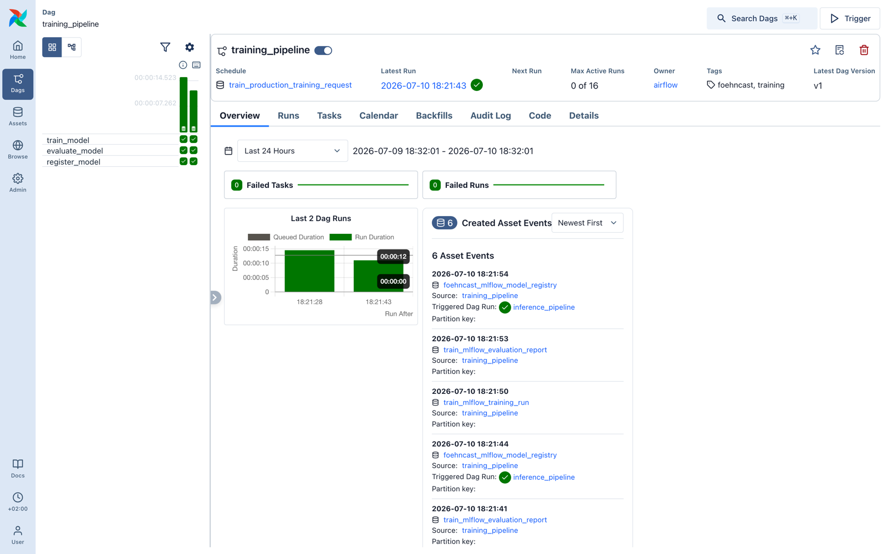
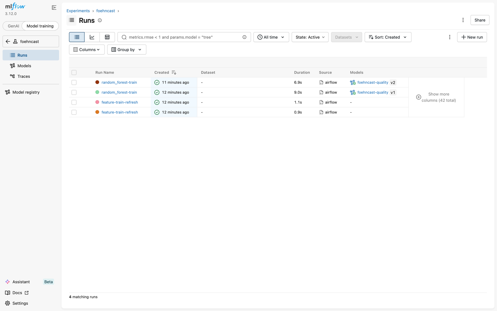
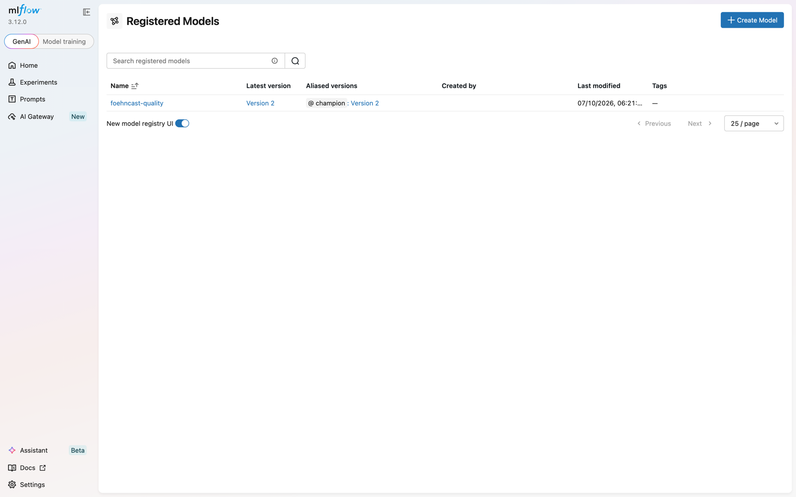

# Visual tour

What the running system looks like, captured from the local Docker stack.

## Rider console

*Ride-quality and wind forecasts, six-spot ranking, and the champion model card.*

## Regional wind map

*Per-spot wind arrows over the region: direction points downwind, color marks rideable status, with an hour slider across the forecast.*

## Orchestration

*The five FoehnCast DAGs, and the training pipeline whose model-registry asset events trigger inference.*

## Experiment tracking

*Pipeline-triggered training runs, two of them registered as model versions.*

## Model registry

*`foehncast-quality` with version 2 carrying the champion alias served by the API.*
