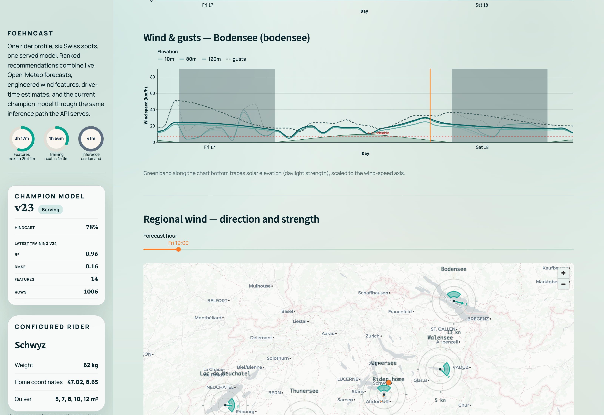

# Visual tour

What the running system looks like, captured from the local Docker stack.

## Rider console

*Session-quality heatmap across the six spots; the selected cell drives the wind dial and the metrics bubble, with the serving champion model in the sidebar.*

## Regional wind map

*Per-spot wind over the region: each wedge points downwind and its length is the speed, with an hour slider across the forecast and the rider home marked.*

## Orchestration

*The five FoehnCast DAGs, and the training pipeline whose model-registry asset events trigger inference.*

## Experiment tracking

*Pipeline-triggered training runs, two of them registered as model versions.*

## Model registry

*`foehncast-quality` with version 2 carrying the champion alias served by the API.*
