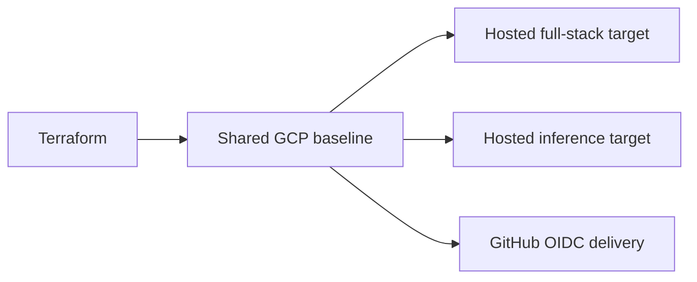

# Terraform Baseline

This directory defines one shared GCP baseline and two hosted runtime targets.

This is maintainer/operator reference material. Default contributor setup stays local with Docker and does not require Terraform, `gcloud`, or `gh`.

## Terraform In One View

| Surface | Purpose | Deploys |
|---------|---------|---------|
| Shared GCP baseline | APIs, storage, identities, and registries | no app containers |
| Hosted full-stack target | keep Airflow, MLflow, and the API online together | runtime services only |
| Hosted inference target | publish the inference API as a smaller hosted surface | FastAPI only |
| GitHub OIDC delivery | remote Terraform and image-based deploys | no runtime services |

## What This Directory Covers

This directory covers two cloud paths:

- a shared GCP baseline for datasets, registries, identities, and the hosted runtime targets
- a single online Docker host target that runs the full Airflow, MLflow, and API stack from the same repo

## Current Scope

Terraform can provision:

- required Google APIs
- Artifact Registry for app images used by the Cloud Run path
- a GCS bucket for shared artifacts
- a BigQuery dataset and feature table
- GitHub OIDC trust and deploy identities
- an inference-only Cloud Run service
- an optional Compute Engine host for the full online container stack

The Cloud Run service remains inference-only. The full online stack is the compose-host path.

## Deployment Scope Rule

Deploy only runtime surfaces in cloud environments.

- The hosted full-stack target deploys Airflow, MLflow, and the API.
- The hosted inference target deploys the FastAPI service only.
- `development_env`, notebooks, docs build tooling, the local objectstore, and the local Datastore emulator stay local or CI-only.

## Which Path To Use

| Target | Use it when | What deploys |
|--------|-------------|--------------|
| Shared GCP baseline | you need the cloud data and identity foundation | no containers |
| Hosted full-stack target | you want Airflow, MLflow, and the API online together | runtime services only |
| Hosted inference target | you only need the inference API | FastAPI only |

## Hosted Inference Target Inputs

When `provision_cloud_run_service = true`, provide:

- a published app image in Artifact Registry
- `mlflow_tracking_uri` pointing to a reachable MLflow service
- any extra runtime configuration in `cloud_run_env_vars`

Terraform already injects the default BigQuery storage environment for the Cloud Run service using the managed dataset and table IDs. Cloud Run should rely on its runtime service account for auth, not on mounted key files.
That runtime service account includes both BigQuery job access and BigQuery Storage API read-session access so pandas-backed BigQuery reads can succeed without falling back to mounted credentials.
Terraform also injects the Feast runtime env contract for the hosted app path: the service gets `FOEHNCAST_FEAST_SOURCE=bigquery`, the managed bucket-backed registry and staging paths, the fully-qualified curated BigQuery table reference used by the rendered Feast runtime config, and the named Datastore-mode database used for Feast online serving.

## Hosted Full-Stack Target Inputs

When `provision_online_compose_host = true`, provide:

- optional image overrides if you do not want the default GHCR `:main` tags
- any extra stack environment in `online_compose_env_vars`

If the hosted Grafana tenant should deliver the provisioned monitoring alerts by email, set `FOEHNCAST_GRAFANA_ALERT_EMAIL` in `online_compose_env_vars`. The local Docker path intentionally leaves that override out of `.env.example` and relies on the placeholder route instead.

Terraform provisions a dedicated network, static public IP, and Compute Engine instance. The instance clones the repo, writes a runtime `.env` file with the Terraform-managed GCP and BigQuery settings, tries to pull the GHCR images, and falls back to local Docker builds on the host if the packages are not available yet.
That generated `.env` now includes the same Feast runtime env contract as the Cloud Run path, so the online host and the inference-only service render the same logical Feast config with different runtime surfaces.
The same generated `.env` also points the hosted MLflow service at `gs://<artifact-bucket>/mlflow/artifacts`, so artifact storage uses the shared cloud object plane instead of a host-local volume.

The hosted baseline also provisions a Firestore Datastore-mode database dedicated to Feast online serving. Using a named database avoids coupling the repo to whatever default Firestore state a reused GCP project may already have.

The host uses a dedicated runtime service account with BigQuery job access, BigQuery Storage API read-session access, BigQuery dataset edit access, bucket object-admin access for MLflow and Feast artifacts, and Datastore user access, so the Airflow, training, Feast, app, and MLflow containers can rely on Application Default Credentials instead of mounted key files.

After curated BigQuery rows are available, run `./scripts/prepare-feast-cloud.sh` on the host or from another shell with ADC to apply the Feast repo and materialize the hosted online store.

On first boot, the host generates an Airflow admin password locally and stores it at `/opt/foehncast/airflow/.admin-password`. Retrieve it over SSH when you need to sign in instead of passing it through Terraform input variables.

The online host starts:

- FastAPI on port `8000`
- Airflow on port `8080` only if you explicitly expose it
- MLflow on port `5001` only if you explicitly expose it

By default, `online_compose_public_ports = [8000]`, so only the app is internet-reachable. If you want public admin UIs, add `8080` or `5001` deliberately.

The compose-host path is the simplest way to keep the whole course stack online without forcing Airflow into Cloud Run.

## What The Hosted Paths Expose

| Path | Public surface by default | Notes |
|------|---------------------------|-------|
| Hosted full-stack target | app on port `8000` | Airflow and MLflow stay private unless explicitly exposed |
| Cloud Run | inference API URL | app-only deployment |

## Teardown

For disposable test environments created from the local bootstrap path, use:

`./scripts/teardown-gcp.sh --plan-only`

Review the destroy preview, then rerun `./scripts/teardown-gcp.sh` without `--plan-only` when you are ready. If the current working copy has no local Terraform state from the bootstrap path, the helper skips the Terraform destroy path but can still run explicit cleanup flags. Otherwise it authenticates with `gcloud`, runs `terraform destroy` against your local `terraform/terraform.tfvars`, and can optionally clean auxiliary deployment state:

- `--clear-github-actions` removes the synced GitHub Actions repository variables from your fork or target repo
- `--delete-state-bucket` deletes `${project_id}-foehncast-tfstate` if you also want to remove the extra bucket created for the remote workflow path
- `--delete-project` queues the bootstrap-created GCP project itself for deletion after the Terraform-managed resources are gone; use this only for disposable smoke environments. The script prompts for the exact project id unless you also pass `--auto-approve`.

This teardown utility is intended for the local bootstrap-and-test path. It destroys Terraform-managed resources from the local state in your working copy. A smoother long-term operator path is to run destroy remotely against the same remote state backend that created the environment, so teardown does not depend on a contributor laptop.

For environments managed through the remote backend, use the manual GitHub Actions Terraform workflow with `command=destroy`. The remote path uses the same OIDC-authenticated backend as remote apply and requires `destroy_confirmation` to exactly match the resolved GCP project id before it will continue.

Remote destroy intentionally stops at Terraform-managed resources tracked in the remote backend. After that, use the same workflow with `command=cleanup` for post-destroy cleanup of the Terraform state bucket and the synced GitHub repository variables when you want to retire the environment fully.

## GitHub Delivery Inputs

The repository uses two delivery workflows:

- `.github/workflows/publish-runtime-images.yml` publishes the runtime images to GHCR
- `.github/workflows/publish-app-image.yml` supports the Artifact Registry plus Cloud Run path for the inference service

Set these GitHub repository variables:

- `GCP_PROJECT_ID`
- `GCP_LOCATION`
- `GCP_ARTIFACT_REPOSITORY`
- `GCP_ARTIFACT_BUCKET_NAME`
- `GCP_BIGQUERY_DATASET`
- `GCP_BIGQUERY_LOCATION`
- `GCP_BIGQUERY_TABLE`
- `GCP_FEAST_ONLINE_STORE_LOCATION`
- `GCP_FEAST_ONLINE_STORE_DATABASE_NAME`
- `GCP_PROVISION_CLOUD_RUN_SERVICE`
- `GCP_CLOUD_RUN_SERVICE_NAME`
- `GCP_CLOUD_RUN_CONTAINER_PORT`
- `GCP_CLOUD_RUN_ALLOW_UNAUTHENTICATED`
- `GCP_CLOUD_RUN_MIN_INSTANCE_COUNT`
- `GCP_CLOUD_RUN_MAX_INSTANCE_COUNT`
- `GCP_CLOUD_RUN_CPU`
- `GCP_CLOUD_RUN_MEMORY`
- `GCP_MLFLOW_TRACKING_URI` when Cloud Run is enabled
- `GCP_PROVISION_ONLINE_COMPOSE_HOST`
- `GCP_ONLINE_COMPOSE_HOST_NAME`
- `GCP_ONLINE_COMPOSE_HOST_ZONE`
- `GCP_ONLINE_COMPOSE_MACHINE_TYPE`
- `GCP_ONLINE_COMPOSE_DISK_SIZE_GB`
- `GCP_WORKLOAD_IDENTITY_PROVIDER`
- `GCP_SERVICE_ACCOUNT_EMAIL`
- `GCP_TERRAFORM_STATE_BUCKET`
- `GCP_TERRAFORM_STATE_PREFIX`
- `GCP_CLOUD_RUN_SERVICE` to enable automatic deploys after publish

The normal shared-environment path is:

1. one-time maintainer bootstrap from Google Cloud Shell
2. GitHub Actions remote apply
3. best-effort repository-variable resync after each successful apply

In normal operation you should not edit these variables by hand. The bootstrap path seeds the shared contract automatically. Remote applies also attempt to resync it, but GitHub's default workflow token may not be allowed to edit repository variables in every repository configuration.

`GCP_CLOUD_RUN_SERVICE` stays unset until Terraform has actually provisioned the Cloud Run service. After that, publish automation can update the service with newly built images.

When `GCP_CLOUD_RUN_SERVICE` is set and the service already exists, the workflow publishes an immutable `sha-<commit>` image tag and then updates the existing Cloud Run service to that image. Terraform remains the source of truth for the service baseline such as service account, scaling, ingress, and environment variables.

## GitHub Actions Terraform Path

Use `.github/workflows/terraform.yml` to run validate, plan, apply, destroy, or cleanup from GitHub Actions without requiring local Terraform. After the one-time bootstrap has established OIDC and the remote backend, pushes to `main` automatically run the shared remote apply path for Terraform-managed cloud changes. Successful applies also attempt to resync the repository variables, but a repository-variable permission limit should not mark the apply itself as failed.

Manual workflow dispatch is still available for plan, destroy, cleanup, and explicit overrides. `./scripts/terraform-remote.sh` remains optional maintainer convenience for people who already use `gh`, but the GitHub Actions workflow is the primary operator surface.

GitHub limits `workflow_dispatch` to 25 inputs. The manual workflow therefore keeps the higher-value environment and topology overrides exposed there, while lower-level Cloud Run sizing defaults such as container port, CPU, and memory stay repo-variable-backed through the Terraform sync contract.

For `command=destroy`, the workflow does not create a missing backend bucket. Instead it fails fast unless the remote state backend already exists, and it requires `destroy_confirmation` to match the resolved GCP project id. That keeps remote teardown explicit and tied to the same state that created the environment.

For `command=cleanup`, the workflow skips Terraform execution entirely. Instead it runs guarded follow-up cleanup actions after a previous destroy. `cleanup_confirmation` must match the resolved GCP project id, and at least one cleanup action must be selected:

- `cleanup_delete_state_bucket=true` deletes the remote Terraform state bucket if it still exists
- `cleanup_clear_github_actions=true` clears the synced GitHub Actions repository variables on the target repository

GitHub can reject repository-variable edits from the default workflow token with `Resource not accessible by integration`. When that happens during the automatic apply path, Terraform still applies successfully and the workflow records that the repository-variable sync was skipped. If you need to refresh or clear the variable contract explicitly, run `./scripts/configure-github-actions.sh` from a maintainer shell authenticated with `gh`.

The recommended remote retirement sequence is:

1. run `command=destroy`
2. verify the destroy result
3. run `command=cleanup` with the specific cleanup flags you want

Remote Terraform is OIDC-only. Missing repository variables should fail fast instead of falling back to a separate secret-based auth path.

After the first bootstrap has created the workload identity provider, deployer service account, and repository variables, the shared environment should normally be advanced by GitHub Actions automatically on `main`. Use manual workflow dispatch only for plan, destroy, cleanup, or deliberate overrides.

## Shared Repo Environment

The upstream repository workflows are intended for the shared project environment. They use repository-scoped variables, package publishing, and cloud identities that belong to that shared environment.

The upstream repository may also publish public GHCR images as convenience artifacts. Those images are meant to reduce setup friction, not to fund or centralize other people's deployments.

The upstream workflows are guarded so jobs run only when both the original actor and the triggering actor are the repository owner.

State-changing upstream jobs should use safeguards that match their risk:

- the remote Terraform workflow uses owner-only execution plus exact project-id confirmations for destroy and cleanup
- `cloud-run-production` remains the protected environment for Cloud Run updates after image publish

Personal cloud deployments are out of scope for the default repo documentation. The documented path here is the shared project environment plus the local Docker setup for contributors.

Automatic Terraform apply on `main` is no longer paused behind a GitHub environment approval. The workflow now relies on owner-only execution plus explicit destroy and cleanup confirmations instead of a per-run reviewer gate.

## Recommended Reading Order

1. Read the root `README.md` for the runtime overview.
2. Use this file when you need the Terraform-specific deployment inputs and teardown steps.
3. Use `docs/site/system/cloud-mapping.md` when you want the higher-level architecture explanation.

## Cloud Operator Bootstrap

Use this only for the initial hosted-environment bootstrap, or when you intentionally need direct admin access to the cloud project.

Preferred environment: Google Cloud Shell. That keeps the admin toolchain off the default evaluator machine and matches the intended operator path.

If you run from another admin shell, keep `gcloud`, `gh`, and `terraform` available there. The supported no-local-install path remains Google Cloud Shell for bootstrap, followed by GitHub Actions for day-2 work.

Supported first-time maintainer path:

`./scripts/bootstrap-gcp.sh --bootstrap-only --configure-github-actions`

The bootstrap script will:

1. Sign in in the browser when `gcloud` opens the login flow.
2. Pick an existing GCP project or type `n` to create a new one.
3. Pick a billing account from the list shown by the script.
4. Confirm or edit the values for region, bucket, Artifact Registry repository, BigQuery dataset, and BigQuery table.
5. Decide which hosted targets should exist after GitHub Actions takes over.
6. Sync the repository variables that GitHub Actions needs for the shared cloud path.

After bootstrap, run the Terraform workflow with `apply` once if you want the shared environment provisioned immediately. After that, pushes to `main` keep the shared environment aligned automatically.

The script writes `.env` and `terraform/terraform.tfvars` during setup and asks explicitly whether the next apply should enable the inference-only Cloud Run target and/or the full online compose host target.

Authentication stays in the active `gcloud` application default credentials for the admin shell you used, while Terraform creates the runtime service accounts for Cloud Run and GitHub delivery.

## Local BigQuery Use

This section is separate from the default local evaluator path and from the Cloud Shell bootstrap path. Use it only when your local Docker services need direct BigQuery access.

1. Bootstrap your local GCP session:
   `./scripts/gcp-auth.sh`
2. If you want local Docker services to read or write BigQuery, initialize `.env` first with `./scripts/bootstrap-local.sh` if needed, then start them with the GCP override file so ADC is mounted into the containers:
   `docker compose -f docker-compose.yml -f docker-compose.gcp.yml up -d`
3. Copy `terraform/terraform.tfvars.example` to `terraform/terraform.tfvars`.
4. Fill in the project-specific values.
5. Run:
   `./scripts/bootstrap-gcp.sh --plan-only`

This Terraform path is aimed at maintainers who are setting up or changing the shared cloud platform.

If the script does not show a billing account, stop and sign in with a Google account that can see one.

Commit `terraform/.terraform.lock.hcl` so provider resolution stays reproducible across local runs and CI.

## CI/CD Guidance

- Prefer GitHub OIDC with `google-github-actions/auth`.
- Do not store service account keys in repository secrets.
- Restrict the OIDC provider to this repository and the `main` branch.
- Grant the deployer service account only the roles needed for build and deploy.
