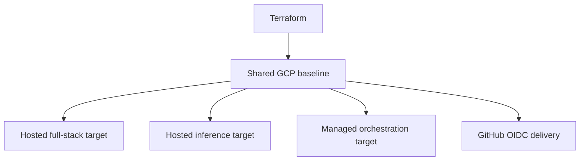

# Terraform Baseline

This directory defines one shared GCP baseline, two hosted runtime targets, and one optional managed orchestration target.

This is maintainer/operator reference material. Default contributor setup stays local with Docker and does not require Terraform, `gcloud`, or `gh`.

Start with [../docs/site/system/delivery-and-operator-workflow.md](../docs/site/system/delivery-and-operator-workflow.md) for the high-level contributor-versus-maintainer split. Use this file when you need the maintainer-specific platform inputs, bootstrap steps, and remote Terraform behavior.

## Terraform In One View

| Surface | Purpose | Deploys |
|---------|---------|---------|
| Shared GCP baseline | APIs, storage, identities, and registries | no app containers |
| Hosted full-stack target | keep Airflow, MLflow, and the API online together | runtime services only |
| Hosted inference target | publish the inference API as a smaller hosted surface | FastAPI only |
| Managed orchestration target | provision Cloud Composer for hosted Airflow readiness work | managed Airflow environment only |
| GitHub OIDC delivery | remote Terraform and image-based deploys | no runtime services |

## What This Directory Covers

This directory covers four cloud surfaces:

- a shared GCP baseline for datasets, registries, identities, and the hosted runtime targets
- an inference-only Cloud Run target for the shared public API
- a single online Docker host target that runs the full Airflow, MLflow, and API stack from the same repo
- an optional Cloud Composer environment for managed-orchestration readiness work

## Current Scope

Terraform can provision:

- required Google APIs
- Artifact Registry for app images used by the Cloud Run path
- a GCS bucket for shared artifacts
- a BigQuery dataset and table for curated features
- a BigQuery dataset and table for retained prediction-event monitoring history
- GitHub OIDC trust and deploy identities
- an inference-only Cloud Run service

The Cloud Run service remains inference-only.
Terraform also seeds `FOEHNCAST_PIPELINE_REPORT_DIR` to the shared `gs://<artifact-bucket>/airflow/reports` prefix across hosted surfaces so feature and training summaries can be written once and then read consistently by retained-host Airflow and the Cloud Run `/metrics` surface.

## Deployment Scope Rule

Deploy only runtime surfaces in cloud environments.

- The hosted full-stack target deploys Airflow, MLflow, and the API.
- The hosted inference target deploys the FastAPI service only.
- `development_env`, notebooks, docs build tooling, the local objectstore, and the local Datastore emulator stay local or CI-only.

## Which Path To Use

| Target | Use it when | What deploys |
|--------|-------------|--------------|
| Shared GCP baseline | you need the cloud data and identity foundation | no containers |
| Hosted full-stack target | you want Airflow, MLflow, and the API online together | runtime services only |
| Hosted inference target | you only need the inference API | FastAPI only |

## Hosted Inference Target Inputs

When `provision_cloud_run_service = true`, provide:

- a published app image in Artifact Registry
- `mlflow_tracking_uri` pointing to a reachable MLflow service
- any extra runtime configuration in `cloud_run_env_vars`

Terraform already injects the default BigQuery storage environment for the Cloud Run service using the managed curated-feature dataset and table IDs. Cloud Run should rely on its runtime service account for auth, not on mounted key files.
That runtime service account includes both BigQuery job access and BigQuery Storage API read-session access so pandas-backed BigQuery reads can succeed without falling back to mounted credentials.
Terraform also provisions the retained `foehncast_monitoring.prediction_events` warehouse table and grants the Cloud Run runtime identity dataset-editor access there so hosted inference can append and read durable prediction-event history without a writable local filesystem contract.
Terraform also injects the Feast runtime env contract for the hosted app path: the service gets `FOEHNCAST_FEAST_SOURCE=bigquery`, the managed bucket-backed registry and staging paths, the fully-qualified curated BigQuery table reference used by the rendered Feast runtime config, and the named Datastore-mode database used for Feast online serving.

This Cloud Run runtime identity is intentionally narrower than the other hosted identities. It exists to serve the inference API, not to act as the general operator or deployment account.

## Transitional VM-Specific Surface

The retained host is still part of the shared environment, but several VM-specific surfaces are transitional rather than long-term design targets.

| Surface | Why it still exists | Classification | Next migration issue |
|--------|----------------------|----------------|----------------------|
| public-port outputs and verification rules | the current hosted contract still needs to prove that Cloud Run is the only public API surface | keep for now | keep until the role changes |

## What The Hosted Paths Expose

| Path | Public surface by default | Notes |
|------|---------------------------|-------|
| Hosted full-stack target | no public app surface by default | Airflow and MLflow stay private unless explicitly exposed |
| Cloud Run | inference API URL | promoted primary hosted API surface |

## Teardown

For disposable test environments created from the local bootstrap path, use:

`./scripts/teardown-gcp.sh --plan-only`

Review the destroy preview, then rerun `./scripts/teardown-gcp.sh` without `--plan-only` when you are ready. If the current working copy has no local Terraform state from the bootstrap path, the helper skips the Terraform destroy path but can still run explicit cleanup flags. Otherwise it authenticates with `gcloud`, runs `terraform destroy` against your local `terraform/terraform.tfvars`, and can optionally clean auxiliary deployment state:

- `--clear-github-actions` removes the synced GitHub Actions repository variables from your fork or target repo
- `--delete-state-bucket` deletes `${project_id}-foehncast-tfstate` if you also want to remove the extra bucket created for the remote workflow path
- `--delete-project` queues the bootstrap-created GCP project itself for deletion after the Terraform-managed resources are gone; use this only for disposable smoke environments. The script prompts for the exact project id unless you also pass `--auto-approve`.

This teardown utility is intended for the local bootstrap-and-test path. It destroys Terraform-managed resources from the local state in your working copy. A smoother long-term operator path is to run destroy remotely against the same remote state backend that created the environment, so teardown does not depend on a contributor laptop.

For environments managed through the remote backend, use the manual GitHub Actions Terraform workflow with `command=destroy`. The remote path uses the same OIDC-authenticated backend as remote apply and requires `destroy_confirmation` to exactly match the resolved GCP project id before it will continue.

Remote destroy intentionally stops at Terraform-managed resources tracked in the remote backend. After that, use the same workflow with `command=cleanup` for post-destroy cleanup of the Terraform state bucket and the synced GitHub repository variables when you want to retire the environment fully.

## GitHub Delivery Inputs

The repository uses two image-publication workflows that share one hosted build contract:

- `.github/workflows/publish-app-image.yml` submits the app image build to Cloud Build and publishes the reviewed image to Artifact Registry for the Cloud Run path
- `.github/workflows/publish-runtime-images.yml` submits the Airflow and MLflow image builds to Cloud Build and publishes the reviewed images to Artifact Registry for the retained operator host

Artifact Registry is the canonical hosted image registry in this contract.

Set these GitHub repository variables:

- `GCP_PROJECT_ID`
- `GCP_LOCATION`
- `GCP_ARTIFACT_REPOSITORY`
- `GCP_ARTIFACT_BUCKET_NAME`
- `GCP_BIGQUERY_DATASET`
- `GCP_BIGQUERY_LOCATION`
- `GCP_BIGQUERY_TABLE`
- `GCP_FEAST_ONLINE_STORE_LOCATION`
- `GCP_FEAST_ONLINE_STORE_DATABASE_NAME`
- `GCP_PROVISION_CLOUD_RUN_SERVICE`
- `GCP_CLOUD_RUN_SERVICE_NAME`
- `GCP_CLOUD_RUN_CONTAINER_PORT`
- `GCP_CLOUD_RUN_ALLOW_UNAUTHENTICATED`
- `GCP_CLOUD_RUN_MIN_INSTANCE_COUNT`
- `GCP_CLOUD_RUN_MAX_INSTANCE_COUNT`
- `GCP_CLOUD_RUN_CPU`
- `GCP_CLOUD_RUN_MEMORY`
- `GCP_MLFLOW_TRACKING_URI` when Cloud Run is enabled
- `GCP_WORKLOAD_IDENTITY_PROVIDER`
- `GCP_SERVICE_ACCOUNT_EMAIL`
- `GCP_TERRAFORM_STATE_BUCKET`
- `GCP_TERRAFORM_STATE_PREFIX`
- `GCP_CLOUD_RUN_SERVICE` to enable automatic deploys after publish

The normal shared-environment path is:

1. one-time maintainer bootstrap from Google Cloud Shell
2. GitHub Actions remote apply
3. best-effort repository-variable resync after each successful apply

GitHub remains the review gate for hosted image publication, but Cloud Build now executes the reviewed hosted image builds on GCP.

In normal operation you should not edit these variables by hand. The bootstrap path seeds the shared contract automatically. Remote applies also attempt to resync it, but GitHub's default workflow token may not be allowed to edit repository variables in every repository configuration.

These repository variables are the structural hosted-delivery contract. They are appropriate for project IDs, regions, resource names, topology toggles, and service-account identifiers. They are not the place for runtime passwords, API tokens, or service-account key files.

If the shared cloud runtime later needs secret-bearing values beyond local-safe placeholders, inject them into the hosted runtime environment or a managed secret path instead of adding them to GitHub repository variables. Endpoints such as `GCP_MLFLOW_TRACKING_URI` should stay credential-free; if auth is required later, inject that secret separately at runtime.

See [../docs/site/system/configuration-and-contracts.md](../docs/site/system/configuration-and-contracts.md) for the reviewed inventory of checked-in examples, bootstrap outputs, GitHub repository variables, runtime environment injection, and identity-backed auth.

`GCP_CLOUD_RUN_SERVICE` stays unset until Terraform has actually provisioned the Cloud Run service. After that, publish automation can update the service with newly built images.

When `GCP_CLOUD_RUN_SERVICE` is set and the service already exists, the workflow publishes an immutable `sha-<commit>` image tag, updates the existing Cloud Run service to that image, and then smoke-checks `/health` plus `/spots`. If the service blocks unauthenticated access, the workflow requests an identity token before calling those routes. Terraform remains the source of truth for the service baseline such as service account, scaling, ingress, and environment variables.
Manual workflow dispatch also supports `deploy_mode=candidate`. That path deploys a tagged no-traffic Cloud Run revision, sets `FOEHNCAST_MLFLOW_SERVING_ALIAS` for that revision, and smoke-checks the tagged URL before any later traffic shift.
After a candidate revision has been validated, `.github/workflows/promote-candidate.yml` promotes the exact validated model version to the live `champion` alias, redeploys the live Cloud Run service with the validated candidate image, and verifies the live `/health` response reports `champion` plus the promoted model version.
That promotion summary also records the pre-promotion live revision and model version so operators can feed those exact values into `.github/workflows/rollback-live-release.yml` if the release needs to be reversed later.
If a live release needs to be reversed, `.github/workflows/rollback-live-release.yml` restores a specific previous Cloud Run revision and a specific previous `champion` model version, verifies the tagged rollback target first, rechecks that tagged target after the alias restore, then restores live traffic and confirms the live `/health` response reports the requested rollback version.

## GitHub Actions Terraform Path

Use `.github/workflows/terraform.yml` to run validate, plan, apply, destroy, or cleanup from GitHub Actions without requiring local Terraform. After the one-time bootstrap has established OIDC and the remote backend, pushes to `main` automatically run the shared remote apply path for Terraform-managed cloud changes. Successful applies also attempt to resync the repository variables, then verify the hosted targets that Terraform exposed through its outputs. A repository-variable permission limit should not mark the apply itself as failed.

Manual workflow dispatch is still available for plan, destroy, cleanup, and explicit overrides. `./scripts/terraform-remote.sh` remains optional maintainer convenience for people who already use `gh`, but the GitHub Actions workflow is the primary operator surface.

GitHub limits `workflow_dispatch` to 25 inputs. The manual workflow therefore keeps the higher-value environment and topology overrides exposed there, while lower-level Cloud Run sizing defaults such as minimum and maximum instance count, container port, CPU, and memory stay repo-variable-backed through the Terraform sync contract.

For `command=destroy`, the workflow does not create a missing backend bucket. Instead it fails fast unless the remote state backend already exists, and it requires `destroy_confirmation` to match the resolved GCP project id. That keeps remote teardown explicit and tied to the same state that created the environment.

For `command=cleanup`, the workflow skips Terraform execution entirely. Instead it runs guarded follow-up cleanup actions after a previous destroy. `cleanup_confirmation` must match the resolved GCP project id, and at least one cleanup action must be selected:

- `cleanup_delete_state_bucket=true` deletes the remote Terraform state bucket if it still exists
- `cleanup_clear_github_actions=true` clears the synced GitHub Actions repository variables on the target repository

GitHub can reject repository-variable edits from the default workflow token with `Resource not accessible by integration`. When that happens during the automatic apply path, Terraform still applies successfully and the workflow records that the repository-variable sync was skipped. If you need to refresh or clear the variable contract explicitly, run `./scripts/configure-github-actions.sh` from a maintainer shell authenticated with `gh`.

The recommended remote retirement sequence is:

1. run `command=destroy`
2. verify the destroy result
3. run `command=cleanup` with the specific cleanup flags you want

Remote Terraform is OIDC-only. Missing repository variables should fail fast instead of falling back to a separate secret-based auth path.

After the first bootstrap has created the workload identity provider, deployer service account, and repository variables, the shared environment should normally be advanced by GitHub Actions automatically on `main`. Use manual workflow dispatch only for plan, destroy, cleanup, or deliberate overrides.

## Shared Repo Environment

The upstream repository workflows are intended for the shared project environment. They use repository-scoped variables, package publishing, and cloud identities that belong to that shared environment.

The upstream workflows are guarded so jobs run only when both the original actor and the triggering actor are the repository owner.

State-changing upstream jobs should use safeguards that match their risk:

- the remote Terraform workflow uses owner-only execution plus exact project-id confirmations for destroy and cleanup
- `cloud-run-production` remains the protected environment for Cloud Run updates after image publish

Personal cloud deployments are out of scope for the default repo documentation. The documented path here is the shared project environment plus the local Docker setup for contributors.

Automatic Terraform apply on `main` is no longer paused behind a GitHub environment approval. The workflow now relies on owner-only execution plus explicit destroy and cleanup confirmations instead of a per-run reviewer gate.

## Recommended Reading Order

1. Read the root `README.md` for the runtime overview.
2. Read `../docs/site/system/delivery-and-operator-workflow.md` for the shared cloud operator flow.
3. Use this file when you need the Terraform-specific deployment inputs and teardown steps.
4. Use `../docs/site/system/cloud-mapping.md` when you want the higher-level architecture explanation.

## Cloud Operator Bootstrap

Use this only for the initial hosted-environment bootstrap, or when you intentionally need direct admin access to the cloud project.

Preferred environment: Google Cloud Shell. It keeps the admin tools off the default evaluator machine and matches the intended operator path.

If you use another admin shell, make sure `gcloud`, `gh`, and `terraform` are available there. The supported no-local-install path is still: bootstrap in Google Cloud Shell, then use GitHub Actions for normal follow-up work.

For the first setup, run:

`./scripts/bootstrap-gcp.sh --bootstrap-only --configure-github-actions`

The bootstrap script will:

1. Sign in when `gcloud` opens the browser login.
2. Choose an existing GCP project, or type `n` to create one.
3. Choose a billing account.
4. Confirm or edit the region, bucket, Artifact Registry repository, BigQuery dataset, and BigQuery table.
5. Choose which hosted targets to enable.
6. Sync the GitHub repository variables used by the shared cloud path.

After bootstrap, run the Terraform workflow with `apply` if you want to provision the shared environment right away. After that, pushes to `main` keep it up to date automatically.

If a normal apply provisions the inference-only Cloud Run target, `./scripts/bootstrap-gcp.sh` checks the Cloud Run `/health` endpoint and the `/spots` route. When the service does not allow unauthenticated access, the script requests an identity token from `gcloud` before calling it.

The script writes `.env` and `terraform/terraform.tfvars` during setup. It also asks whether the next apply should enable the inference-only Cloud Run target.

Authentication stays in the active `gcloud` application default credentials for the shell you used. Terraform creates the runtime service accounts for Cloud Run and GitHub delivery.

## Local BigQuery Use

This section is separate from the default local evaluator path and from the Cloud Shell bootstrap path. Use it only when your local Docker services need direct BigQuery access.

1. Bootstrap your local GCP session:
   `./scripts/gcp-auth.sh`
2. If you want local Docker services to read or write BigQuery, initialize `.env` first with `./scripts/bootstrap-local.sh` if needed, then start them with the GCP override file so ADC is mounted into the containers:
   `docker compose -f docker-compose.yml -f docker-compose.gcp.yml up -d`
3. Copy `terraform/terraform.tfvars.example` to `terraform/terraform.tfvars`.
4. Fill in the project-specific values.
5. Run:
   `./scripts/bootstrap-gcp.sh --plan-only`

This Terraform path is aimed at maintainers who are setting up or changing the shared cloud platform.

If the script does not show a billing account, stop and sign in with a Google account that can see one.

Commit `terraform/.terraform.lock.hcl` so provider resolution stays reproducible across local runs and CI.

## CI/CD Guidance

- Prefer GitHub OIDC with `google-github-actions/auth`.
- Do not store service account keys in repository secrets.
- Restrict the OIDC provider to this repository and the `main` branch.
- Grant the deployer service account only the roles needed for build and deploy.
